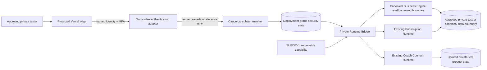
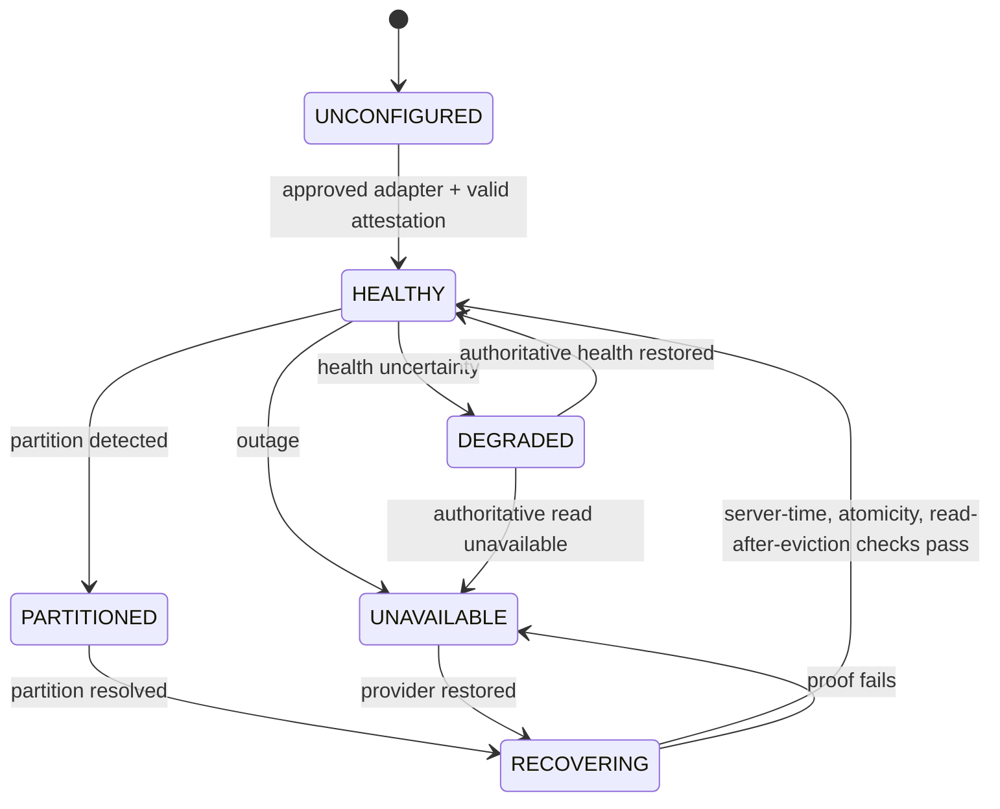
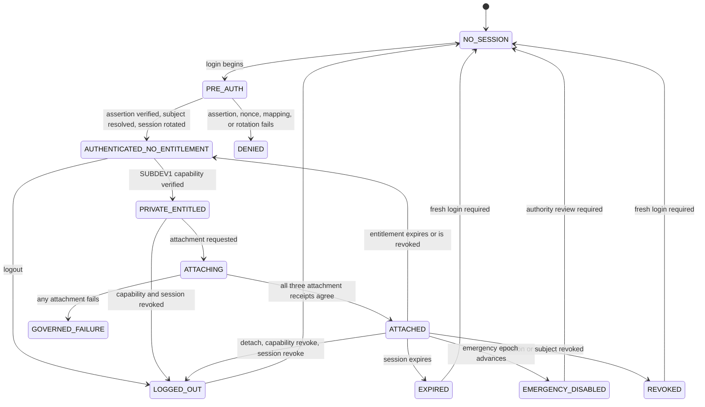
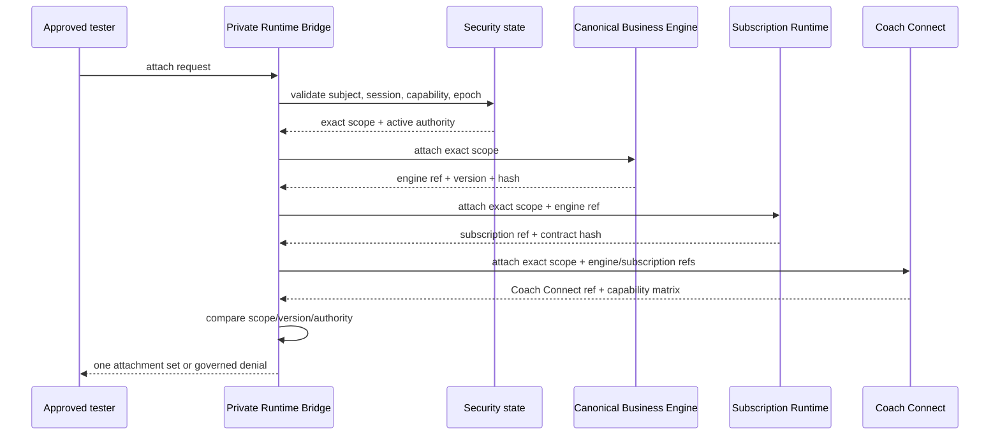

# MORE Campaign — Coach Connect Private Runtime Enablement V1

Campaign:
`MORE_CAMPAIGN_COACH_CONNECT_PRIVATE_RUNTIME_ENABLEMENT_V1`

Mission type: `TIER_1_ARCHITECTURE`

Architecture date: `2026-07-26`

Repository:
`/Users/rrg/.openclaw/workspace/moremindmap-live`

Repository baseline:
`d5a93c81d509b3ca71c398f78747018bd8125f62`

Architecture status:
`PRIVATE_RUNTIME_ENABLEMENT_ARCHITECTURE_COMPLETE`

Implementation authorized: `false`

Deployment authorized: `false`

Commit authorized: `false`

---

## 1. Executive decision

MORE MindMap will add one narrow, server-side **Private Runtime Bridge** between
the existing authenticated-subscriber security contracts and the existing
Business Engine, Subscription Runtime, and Coach Connect runtimes.

The bridge does not create a developer Business Engine, a developer
subscription runtime, a developer Coach Connect, or a parallel source of
truth. It resolves one approved external subject to one immutable canonical
subscriber scope, elevates one server-owned session, verifies one temporary
`SUBDEV1` entitlement, and attaches that exact scope to the existing runtime
services.

```text
protected edge identity + MFA
            |
            v
subscriber authentication assertion
            |
            v
canonical subject resolution
            |
            v
server-owned authenticated session
            |
            v
SUBDEV1 temporary entitlement
            |
            v
Private Runtime Bridge
      /          |          \
     v           v           v
canonical     existing     existing
Business      Subscription Coach Connect
Engine        Runtime      Runtime
```

The architecture is default-off. Missing configuration, authority, subject
mapping, deployment-grade security state, session, entitlement, exact scope,
runtime attachment, or emergency-control health denies access.

The bridge may later enable only a named, approved private tester and exact
allowlisted canonical scope. Global public activation remains false. Stripe,
paid entitlement, public registration, live media/model providers, transcript
persistence, production customer data, production product persistence,
migration, destructive deletion, and canonical promotion remain disabled.

### 1.1 Success path

The required success path is:

```text
SUBDEV1 private entry surface
  -> named edge identity with MFA
  -> verified subscriber assertion
  -> exactly one canonical subscriber mapping
  -> rotated server-owned authenticated session
  -> subject/session/browser-bound temporary entitlement
  -> exactly one canonical Business Engine attachment
  -> existing Subscription Runtime attachment
  -> existing Coach Connect attachment
  -> governed private interactions
```

`SUBDEV1` is an entitlement gate after authentication. It is not an identity
provider, operator identity, administrator role, billing grant, or canonical
write authority.

### 1.2 Architecture decisions

1. Reuse the ratified provider-neutral subscriber authority contract. The
   approved initial provider adapter remains Auth0 OIDC, but this packet does
   not activate or connect Auth0.
2. Reuse the ratified opaque rotating BFF session and `__Host-` cookie
   contract.
3. Reuse the existing shared-security-state port. Deployment-grade security
   state is mandatory; in-memory state is prohibited for private-live use.
4. Persist canonical subject mappings as security control-plane records, not
   Business Engine or customer-content records.
5. Compose existing runtimes through exact-scope attachment ports. Do not copy,
   rebuild, or fork any runtime.
6. Keep defaults false. A short-lived, server-side capability envelope may
   enable only the approved tester, session, scope, and private interaction
   allowlist.
7. Separate security control-plane state from isolated private-test product
   state. Neither may connect to a production customer-data namespace.
8. Require an emergency disable that invalidates new attachments immediately
   and revokes existing private-runtime sessions through a security epoch.

---

## 2. Authority and non-authority

This packet is architecture only. It authorizes creation and review of this
document and nothing else.

It does not authorize:

- source implementation;
- Auth0 application inspection, creation, configuration, or activation;
- Redis, Upstash, or another shared-store connection;
- credentials, secrets, environment variables, or access-code changes;
- Vercel inspection, project action, deployment, domain, or alias action;
- public access or public registration;
- production customer data;
- production product persistence;
- transcript or recording persistence;
- model, media, voice, video, or object-store providers;
- Stripe, checkout, billing, or paid entitlement;
- migration or destructive deletion;
- canonical Business Engine mutation or promotion;
- staging, commit, push, or production certification.

The approved Human Decision Ratification dated `2026-07-24` remains
authoritative for subscriber identity, session ownership, and shared security
state. Its relevant decisions are:

| Decision | Ratified choice | Status in this packet |
|---|---|---|
| `SUBSCRIBER_AUTHORITY_SOURCE` | Dedicated Auth0 subscriber OIDC authority; immutable `(issuer, sub)` mapping; provider-neutral internal contract | Reused, not activated |
| `SUBSCRIBER_SESSION_OWNER` | Server-owned opaque rotating BFF session with atomic pre-auth invalidation | Reused |
| `SHARED_STATE_PLATFORM` | Dedicated Upstash security-state adapter conditional on capability proof | Reused as selected initial adapter; provider-neutral port remains authoritative; no connection authorized |

This packet does not reopen those decisions.

---

## 3. Repository-grounded state

### 3.1 Proven blockers

| Blocker | Repository evidence | Architectural resolution |
|---|---|---|
| Production runtime denies developer access | `api/internal/developer-access-security.js:58-60` | Replace environment-name denial with a private-runtime authority decision that still defaults off and requires all private-live gates |
| Default state is in-memory | `api/internal/developer-access-security.js:22`; `productionSecurity/inMemorySharedSecurityState.js:65,93` | Inject a validated deployment-grade shared-security-state adapter through a composition root; never silently fall back |
| Exported handler has no canonical resolver | `api/internal/developer-access.js:67-68,82-88,169` | Bind the exported internal handler to the canonical subject/session resolver supplied by the Private Runtime Bridge |

These are runtime-composition gaps. They are not deployment or provider-adapter
failures.

### 3.2 Existing security foundations to reuse

- `productionSecurity/subjectBinding.js:88-199` already defines a
  canonical-subscriber registry with duplicate-subject and duplicate-scope
  denial.
- `productionSecurity/subjectBinding.js:201-220` already converts a valid
  canonical subject plus active session into the developer binding input.
- `productionSecurity/sessionElevation.js:17-182` already defines pre-auth
  creation, assertion-to-subject validation, atomic rotation, replay denial,
  session receipts, and the `__Host-more_session` cookie contract.
- `productionSecurity/sharedSecurityStatePorts.js:4-45` already names the
  security-state methods.
- `productionSecurity/sharedSecurityStatePorts.js:48-120` already validates
  the port and requires `DEPLOYMENT_APPROVED`, deployment-grade,
  fail-closed capability before live use.
- `api/internal/subscription-entitlement.js:11-51` already translates a valid
  developer capability to
  `temporary_internal_subscription_entitlement`, with Stripe, billing,
  operator, coach, admin, and canonical authority false.

The bridge consumes these contracts. It does not replace them.

### 3.3 Existing runtime foundations to reuse

- The canonical object doctrine states that `BusinessEngineContract` is the
  read-side projection of the canonical event/state system, not a new write
  store (`docs/intelligence_fabric/MORE_CANONICAL_OBJECT_MAP_V1.md:5`).
- The shared identity model keeps `profile_id`, `business_id`,
  `subscription_id`, and `tenant_id` distinct
  (`MORE_CANONICAL_OBJECT_MAP_V1.md:39-41`).
- `createSubscriberRuntimeService` exposes the existing subscription commands
  and queries behind exact activation and authorization checks
  (`production/subscriberService.js:2-6`).
- Subscription Runtime defaults are disabled, emergency-disabled, read-only,
  and empty-allowlist (`production/activation.js:2-5`).
- Coach Connect defaults are disabled and deny live auth, billing, model,
  media, and production traffic (`coachConnect/activation.js:3-5`).
- `createCoachConnectService` accepts injected stores and flags, and its
  inspection contract already asserts one Business Engine and no second engine
  (`coachConnect/service.js:15-18,90-91`).
- `BusinessAssessmentVisualMap.jsx:153-154,220` already renders the one
  `businessEngineContract`.
- `DeveloperAccessPanel` already supports a verified server response and an
  `onUnlocked` attachment callback
  (`DeveloperAccessPanel.jsx:3,14-17`).

### 3.4 Dirty-worktree boundary

The starting worktree contains unrelated modified Business Engine and Business
Assessment files plus prior untracked campaign artifacts. They belong to the
user and are not inputs to, or outputs of, this architecture mission.

The architecture artifact is the only permitted repository write in this
mission. No existing file may be staged, reverted, reformatted, or absorbed.

---

## 4. Architecture principles

1. **One subject, one scope.** One active `(issuer, immutable subject)` maps to
   one canonical subscriber scope. One scope cannot map to two active subjects.
2. **One Business Engine.** Attach by immutable reference, version, and hash.
   Never clone canonical state.
3. **Authentication precedes `SUBDEV1`.** The shared private code cannot create
   identity or session authority.
4. **Deployment-grade security state is control-plane state.** It contains
   sessions, mappings, capabilities, nonces, replay keys, epochs, and
   privacy-safe receipts—not Business Engine content, transcripts, or customer
   payloads.
5. **Default-off means absent authority denies.** Deployment or provider
   classification does not enable the bridge.
6. **Scoped enablement is not global activation.** A private capability
   envelope applies to one environment, subject, session, browser, and exact
   canonical scope.
7. **No local fallback.** Store outage, restart uncertainty, mapping ambiguity,
   or attachment mismatch fails closed.
8. **Receipts before claims.** Runtime readiness is true only when the subject,
   session, entitlement, and all three attachment receipts agree.
9. **Reversible access, immutable identity.** Entitlement and sessions are
   revocable; canonical identity cannot be silently reassigned.
10. **Governed interactions only.** Existing confirmation, consent,
    relationship, privacy, and canonical-promotion gates remain authoritative.

---

## 5. Trust boundaries



### 5.1 Boundary distinctions

| Boundary | Authority it may grant | Authority it must never grant |
|---|---|---|
| Protected provider edge | Reach the private application after named MFA | Subscriber scope, billing, product activation |
| Subscriber authentication | Verified immutable external subject assertion | Business scope before canonical resolution |
| Canonical subject resolver | Exact canonical subscriber scope | Operator, coach, billing, deployment |
| `SUBDEV1` | Temporary private subscription entitlement | Authentication, identity creation, paid entitlement |
| Private Runtime Bridge | Exact-scope attachment and approved runtime calls | Global flags, scope expansion, canonical bypass |
| Business Engine | Existing canonical state and governed mutation boundary | Runtime access decision |
| Subscription Runtime | Existing query/command semantics | Stripe or public onboarding |
| Coach Connect | Existing implemented capabilities under existing gates | Private-note disclosure, automatic canonical promotion |

### 5.2 Data-plane separation

Three state classes must remain separate:

1. **Security control plane:** canonical mapping, sessions, capability hashes,
   nonces, replay state, rate controls, security epochs, and audit receipts.
2. **Canonical/business data plane:** the existing Business Engine and
   Subscription Runtime sources of truth.
3. **Isolated private-test product state:** only private-test Coach Connect and
   subscription interaction records required by already implemented
   semantics, under an exact non-production namespace.

Security state must never become a product-content store. Private-test product
state must never point at a production customer namespace. No migration copies
production customer data into the private environment.

---

## 6. Canonical subject resolution

### 6.1 Identity layers

The private runtime has three independent proofs:

```text
edge_identity_ref
  proves: named protected-target access with MFA

subscriber_assertion_ref
  proves: authenticated application subscriber identity

subdev1_capability_ref
  proves: temporary private subscription entitlement
```

All three are required. None substitutes for another.

### 6.2 Verified subscriber assertion

The application receives no raw token through the bridge contract. A
provider-specific verifier validates the OIDC response and emits:

```json
{
  "schema_version": "private-runtime-verified-assertion-v1",
  "assertion_reference": "opaque",
  "subject_id": "opaque immutable provider subject",
  "issuer": "exact approved issuer",
  "audience": "exact approved audience",
  "auth_strength": "approved value",
  "session_binding_reference": "opaque browser binding",
  "authenticated_at": "ISO-8601",
  "security_version": 1,
  "status": "VERIFIED"
}
```

Forbidden fields include raw token, access token, ID token, cookie,
credential, email, name, or provider assertion body.

### 6.3 Canonical subject mapping

The existing canonical subject shape remains authoritative:

```json
{
  "schema_version": "production-security-prerequisite-v1",
  "subscriber_subject_id": "opaque",
  "issuer": "exact",
  "audience": "exact",
  "tenant_id": "opaque",
  "profile_id": "opaque",
  "business_id": "opaque",
  "subscriber_id": "opaque",
  "mapping_version": 1,
  "security_version": 1,
  "status": "ACTIVE",
  "source_assertion_reference": "opaque",
  "bound_at": "ISO-8601",
  "effective_at": "ISO-8601",
  "revoked_at": null,
  "reassignment_prohibited": true
}
```

The deployment-grade registry must add provider-neutral atomic operations:

```text
resolveExternalSubject(issuer, subject_id)
resolveCanonicalSubject(subscriber_subject_id)
resolveExactScope(tenant_id, profile_id, business_id, subscriber_id)
atomicBindExternalSubjectToExactScope(assertion, approved_scope, approval)
beginSubjectRecovery(subject_ref, authority, reason)
completeSubjectRecovery(recovery_ref, authority)
disableSubject(subject_ref, reason)
health()
describeCapability()
```

### 6.4 Enrollment

Private enrollment is human-preprovisioned:

1. A founder-approved tester record names the tester by opaque identity
   reference and exact permitted scope.
2. The person authenticates through the approved subscriber authority.
3. A privileged enrollment operation compares the verified immutable subject
   with the approved tester record.
4. `atomicBindExternalSubjectToExactScope` succeeds only when neither the
   external subject nor exact scope has a conflicting active mapping.
5. A content-free binding receipt is written.
6. The enrollment authority expires. The user cannot self-enroll or choose a
   Profile ID.

No email lookup, fuzzy matching, display-name matching, URL Profile ID, browser
storage value, or `SUBDEV1` code may create a mapping.

### 6.5 Subject resolution receipt

```json
{
  "subject_receipt_version": "private-runtime-subject-receipt-v1",
  "receipt_id": "opaque",
  "environment_id": "opaque",
  "assertion_ref_hash": "sha256",
  "subscriber_subject_ref": "opaque",
  "exact_scope_hash": "sha256",
  "mapping_version": 1,
  "security_version": 1,
  "resolution_result": "RESOLVED",
  "duplicate_subject_detected": false,
  "duplicate_scope_detected": false,
  "resolved_at": "ISO-8601",
  "policy_version": "opaque",
  "correlation_id": "opaque"
}
```

The receipt contains no identity name, email, raw assertion, token, cookie,
`SUBDEV1` value, or business content.

### 6.6 Resolution outcomes

| Condition | Result |
|---|---|
| Exact active mapping | `RESOLVED` |
| No mapping | `SUBJECT_MAPPING_NOT_FOUND` |
| Subject maps to another scope | `SUBJECT_MAPPING_AMBIGUOUS` |
| Scope maps to another subject | `SUBJECT_MAPPING_AMBIGUOUS` |
| Mapping/security version mismatch | `SUBJECT_MAPPING_STALE` |
| Disabled or recovery-pending | `SUBJECT_DISABLED` |
| Deleted | `SUBJECT_DELETED` |
| Store unavailable or partitioned | `SHARED_SECURITY_STATE_UNAVAILABLE` |

No failure auto-creates, repairs, reassigns, or guesses a mapping.

---

## 7. Deployment-grade security runtime

### 7.1 Provider-neutral contract

The existing `SHARED_SECURITY_STATE_METHODS` contract remains the minimum:

- capability description and health;
- authoritative server time;
- atomic session creation and rotation;
- session lookup and revocation;
- single-use nonce consumption;
- idempotency/replay claim and completion;
- distributed rate limiting;
- capability hash put/get/revoke;
- security and deletion epochs;
- retention leases;
- durable privacy-safe audit receipts.

The canonical subject mapping operations in Section 6 are an adjacent identity
registry port backed by the same deployment-grade security control plane or an
equally capable isolated security store. They do not change Business Engine or
product-persistence contracts.

### 7.2 Required capability attestation

Private-live enablement requires:

```json
{
  "contract_version": "ratified version",
  "adapter_class": "DEPLOYMENT_APPROVED",
  "provider": "provider adapter identifier",
  "deployment_grade": true,
  "available": true,
  "atomicity_verified": true,
  "authoritative_reads_from_primary_only": true,
  "durable_persistence_verified": true,
  "server_time_ttl_verified": true,
  "backup_capability_verified": true,
  "regional_behavior_verified": true,
  "outage_fail_closed_verified": true,
  "read_after_eviction_verified": true,
  "no_local_fallback": true,
  "environment_id": "exact private environment"
}
```

Any missing or false field denies runtime attachment.

### 7.3 Selected initial adapter boundary

The prior human ratification selected a dedicated Upstash security-state
adapter, conditional on capability proof. This architecture remains
provider-neutral: the bridge depends only on ports and attestations.

This packet does not authorize:

- creating or inspecting Upstash;
- credentials;
- a live connection;
- production Redis activation;
- using a production application-data Redis;
- weakening a port requirement to fit a provider.

A later implementation/deployment authorization must name the exact isolated
security store, adapter version, environment, credential owner, activation
window, and rollback owner.

### 7.4 Security records only

Permitted security-state records:

- canonical subject mappings;
- private tester approvals by opaque reference;
- pre-auth and authenticated sessions;
- capability token hashes and revocation state;
- CSRF grants, nonces, replay claims, rate-limit counters;
- security/deletion epochs and fencing tokens;
- privacy-safe audit and runtime attachment receipts.

Prohibited:

- Business Engine contracts or source records;
- BA/BOS/Five Futures/One Move payloads;
- subscriber conversation content;
- coach notes, transcripts, media, model context;
- Stripe/customer/billing records;
- raw identity assertions, tokens, cookies, access codes, names, emails, or
  raw IP addresses.

### 7.5 Availability behavior



Only `HEALTHY` permits a new login, `SUBDEV1` issuance, or runtime attachment.
Existing requests fail closed when authoritative session/revocation state
cannot be read. No process-local state is authoritative.

---

## 8. Private runtime authority

### 8.1 Private tester approval record

```json
{
  "approval_version": "private-runtime-tester-approval-v1",
  "approval_id": "opaque",
  "environment_id": "opaque",
  "tester_subject_ref": "opaque pre-enrollment reference",
  "exact_scope_hash": "sha256",
  "purpose": "FOUNDER_PRIVATE_RUNTIME_TEST",
  "capability_allowlist": [
    "BUSINESS_ENGINE_READ",
    "SUBSCRIPTION_INTERACTION",
    "COACH_CONNECT_SUBSCRIBER"
  ],
  "approved_by": "opaque human authority ref",
  "approved_at": "ISO-8601",
  "expires_at": "ISO-8601",
  "status": "ACTIVE",
  "public_launch_authorized": false,
  "paid_entitlement_authorized": false,
  "canonical_promotion_authorized": false
}
```

The first active approval must be founder-only. Darren, Coach Wally, Jon Gwin,
or another tester requires a separate explicit record. No group wildcard,
email-domain rule, or automatic broadening is permitted.

### 8.2 Runtime capability envelope

After authentication and `SUBDEV1` verification, the server creates:

```json
{
  "envelope_version": "private-runtime-capability-v1",
  "capability_id": "opaque",
  "environment_id": "opaque",
  "subscriber_subject_ref": "opaque",
  "authenticated_session_ref": "opaque",
  "subject_security_version": 1,
  "session_epoch": 1,
  "browser_binding_hash": "sha256",
  "exact_scope_hash": "sha256",
  "entitlement_source": "temporary_internal_subscription_entitlement",
  "allowed_runtime_actions": [
    "BUSINESS_ENGINE_READ",
    "SUBSCRIPTION_INTERACTION",
    "COACH_CONNECT_SUBSCRIBER"
  ],
  "issued_at": "ISO-8601",
  "expires_at": "ISO-8601",
  "status": "ACTIVE",
  "stripe_authority": false,
  "billing_authority": false,
  "operator_authority": false,
  "deployment_authority": false,
  "coach_authority": false,
  "canonical_mutation_authority": false
}
```

The envelope is server-side. The browser holds only opaque, secure cookies.
The envelope expires no later than the shortest of tester approval, subscriber
session, or `SUBDEV1` entitlement.

### 8.3 Default-off flags

The future composition root must default to:

```json
{
  "private_runtime_enabled": false,
  "private_runtime_environment_allowlist": [],
  "private_runtime_subject_allowlist": [],
  "private_runtime_scope_allowlist": [],
  "subject_resolution_enabled": false,
  "shared_security_state_enabled": false,
  "subdev1_enabled": false,
  "subscription_runtime_private_enabled": false,
  "coach_connect_private_enabled": false,
  "private_test_writes_enabled": false,
  "live_model_provider_enabled": false,
  "live_media_provider_enabled": false,
  "transcript_persistence_enabled": false,
  "production_product_persistence_enabled": false,
  "migration_enabled": false,
  "destructive_deletion_enabled": false,
  "stripe_enabled": false,
  "paid_entitlement_enabled": false,
  "public_registration_enabled": false,
  "public_traffic_enabled": false,
  "emergency_disabled": true
}
```

For a private session to run, a server-side authority bundle may temporarily
deassert `emergency_disabled` and enable the exact private-runtime capabilities
for one approved environment, subject, and scope. Defaults in source remain
false. The emergency switch remains independently assertable and dominant.

---

## 9. Session lifecycle

### 9.1 State machine



### 9.2 Login

1. Confirm protected-edge access and privacy-safe MFA attestation.
2. Confirm private-runtime environment and approval window.
3. Create an unprivileged pre-auth session with state/nonce/PKCE and browser
   binding.
4. Verify the provider assertion through the ratified provider-neutral port.
5. Resolve the canonical subject; do not bind automatically except through an
   active enrollment approval.
6. Atomically rotate the pre-auth session to a new authenticated session.
7. Store only the authenticated-session token hash; set
   `__Host-more_session`, HttpOnly, Secure, SameSite=Lax, Path=/.
8. Emit assertion, resolution, and rotation receipts.

### 9.3 `SUBDEV1` elevation

1. Require the active authenticated session and subject mapping.
2. Issue and consume a CSRF grant.
3. Verify the private access code server-side.
4. Apply abuse controls.
5. Store only the capability hash.
6. Bind the capability to subject, exact scope, browser, security version,
   session epoch, environment, issuer, audience, and expiry.
7. Set the `__Host-coach_connect_dev_capability` HttpOnly Secure
   SameSite=Strict cookie.
8. Resolve the temporary subscription entitlement and emit a receipt.

The code is never logged, packaged, returned, persisted in a receipt, or
embedded in a client bundle.

### 9.4 Request validation

Every runtime request must revalidate:

- environment and activation authority;
- security-store health;
- session token hash, status, expiry, idle expiry, security version, and epoch;
- canonical subject status and exact scope;
- current tester approval and expiry;
- `SUBDEV1` capability status and binding;
- request origin and CSRF for mutations;
- requested action against the capability envelope;
- attachment versions and hashes.

No request trusts a prior client-side `unlocked` state.

### 9.5 Logout and revocation

Logout order:

1. stop new runtime calls;
2. revoke the `SUBDEV1` capability;
3. revoke the authenticated session;
4. invalidate CSRF grants and advance the session epoch as required;
5. clear both secure cookies;
6. detach runtime handles;
7. emit a content-free logout receipt.

Emergency disable advances an environment security epoch, denies new
attachments, and makes every earlier capability/session envelope stale.

### 9.6 Restart and recovery

After an application restart:

- no process-local snapshot is authoritative;
- the new instance validates the security-store capability and health;
- the opaque session cookie is revalidated against authoritative state;
- subject mapping and approval are re-resolved;
- runtime attachments are rebuilt from exact canonical references;
- no duplicate canonical operation is replayed without its existing
  idempotency key;
- attachment readiness remains false until all current hashes agree.

If any store or runtime cannot recover, the user receives a governed
unavailable state and no fallback runtime.

---

## 10. Runtime attachment model

### 10.1 Exact scope

Every attachment uses the same immutable vector:

```json
{
  "tenant_id": "opaque",
  "profile_id": "opaque",
  "business_id": "opaque",
  "subscriber_id": "opaque"
}
```

`subscription_id` may be attached only when resolved from the existing
Subscription Runtime for this exact scope. It is not inferred from Profile ID,
URL state, email, or the `SUBDEV1` code.

### 10.2 Attachment request

```json
{
  "request_version": "private-runtime-attachment-request-v1",
  "environment_id": "opaque",
  "subscriber_subject_ref": "opaque",
  "authenticated_session_ref": "opaque",
  "capability_ref": "opaque",
  "exact_scope": {
    "tenant_id": "opaque",
    "profile_id": "opaque",
    "business_id": "opaque",
    "subscriber_id": "opaque"
  },
  "requested_attachments": [
    "BUSINESS_ENGINE",
    "SUBSCRIPTION_RUNTIME",
    "COACH_CONNECT"
  ],
  "correlation_id": "opaque",
  "requested_at": "ISO-8601"
}
```

### 10.3 Coordinator invariant

The `PrivateRuntimeAttachmentCoordinator` performs, in order:

1. subject/session/capability validation;
2. canonical Business Engine attachment;
3. Subscription Runtime attachment to the same scope and Business Engine
   reference;
4. Coach Connect attachment to the same scope, subscription reference, and
   Business Engine reference;
5. cross-receipt consistency validation;
6. publication of one runtime attachment set.

Failure at step N discards all handles created in the attempt. It does not
leave a partial runtime active.



### 10.4 Business Engine attachment

The adapter may call only existing canonical read/command boundaries. It must
return:

```json
{
  "receipt_version": "business-engine-attachment-v1",
  "attachment_id": "opaque",
  "subscriber_subject_ref": "opaque",
  "exact_scope_hash": "sha256",
  "business_engine_ref": "opaque",
  "business_engine_version": "opaque",
  "business_engine_contract_hash": "sha256",
  "source": "CANONICAL_BUSINESS_ENGINE",
  "read_authorized": true,
  "write_authorized": false,
  "duplicate_engine_created": false,
  "attached_at": "ISO-8601"
}
```

Hard rules:

- `source` must equal `CANONICAL_BUSINESS_ENGINE`;
- the contract hash must match the existing canonical projection;
- no Business Engine object is copied into a bridge-owned store;
- no Profile ID is generated or reassigned;
- no canonical write is implied by attachment;
- missing or ambiguous engine state returns
  `BUSINESS_ENGINE_ATTACHMENT_NOT_FOUND` or
  `BUSINESS_ENGINE_ATTACHMENT_AMBIGUOUS`.

### 10.5 Subscription Runtime attachment

The bridge constructs the existing subscriber command/query envelope from the
canonical subject, active session, and exact scope. The existing Subscription
Runtime remains the only runtime.

```json
{
  "receipt_version": "subscription-runtime-attachment-v1",
  "attachment_id": "opaque",
  "subscriber_subject_ref": "opaque",
  "authenticated_session_ref": "opaque",
  "exact_scope_hash": "sha256",
  "business_engine_attachment_ref": "opaque",
  "subscription_ref": "opaque",
  "runtime_contract_version": "opaque",
  "entitlement_source": "temporary_internal_subscription_entitlement",
  "allowed_interactions": [
    "READ_CURRENT_STATE",
    "REQUEST_EVIDENCE_GAPS",
    "READ_BUSINESS_ENGINE",
    "READ_FIVE_FUTURES",
    "READ_ONE_MOVE",
    "REQUEST_EXPLANATION",
    "START_SESSION",
    "SUBMIT_TURN",
    "DECIDE_EXTRACTION"
  ],
  "paid_entitlement": false,
  "stripe_authority": false,
  "canonical_write_authority": false,
  "attached_at": "ISO-8601"
}
```

`APPEND_CONFIRMED_EVIDENCE`, `REFRESH_INTELLIGENCE`,
`SUBMIT_EXECUTION`, and `SUBMIT_OUTCOME` may be added to the exact private
allowlist only when:

- the existing confirmation and authorization contracts pass;
- an isolated private-test product-state adapter is attested;
- no production customer-data namespace is reachable;
- writes remain idempotent and reversible at the test-environment boundary;
- canonical promotion remains separately governed.

This does not activate production product persistence. It uses the existing
injected persistence interfaces against an isolated, non-production,
founder-approved test scope with no migration.

### 10.6 Coach Connect attachment

The bridge calls the existing `createCoachConnectService` composition boundary.
It does not duplicate service logic or alter Coach Connect state machines.

```json
{
  "receipt_version": "coach-connect-attachment-v1",
  "attachment_id": "opaque",
  "subscriber_subject_ref": "opaque",
  "exact_scope_hash": "sha256",
  "business_engine_attachment_ref": "opaque",
  "subscription_runtime_attachment_ref": "opaque",
  "coach_connect_runtime_ref": "opaque",
  "allowed_capabilities": [
    "SUBSCRIBER_PROJECTION",
    "STRUCTURED_NON_VOICE_SESSION_WHEN_ALREADY_AUTHORIZED"
  ],
  "live_auth_provider": false,
  "live_billing": false,
  "live_model_provider": false,
  "live_voice_video": false,
  "transcript_persistence": false,
  "canonical_mutation_authority": false,
  "second_business_engine": false,
  "attached_at": "ISO-8601"
}
```

Invitation, relationship, cockpit, and structured-session capabilities may run
only to the extent already implemented and only when their existing coach
identity, relationship, consent, entitlement, privacy, exact-scope, and
idempotency gates pass. `SUBDEV1` never grants coach authority.

Checkout and billing-event capabilities remain false. Proposal routing cannot
append to canonical state unless the existing canonical promotion ladder and a
separate authority permit it.

### 10.7 Isolated private-test product state

Stateful private interactions must use adapters that implement the existing
Subscription Runtime and Coach Connect store surfaces. Requirements:

- exact private environment and tenant/profile/business/subscriber namespace;
- no production/customer records;
- no migration from production;
- no shared namespace with the public project;
- deployment-grade restart behavior for every state claimed durable;
- idempotency and optimistic-concurrency behavior where the existing contract
  requires them;
- transcript/media payloads prohibited;
- rollback and teardown capability;
- provider-neutral injection;
- no local JSONL in a hosted runtime;
- no physical deletion claim for local append-only JSONL.

If a required existing store surface cannot be adapted without redesigning
Subscription Runtime or Coach Connect, implementation stops for architecture
review.

### 10.8 Attachment set

```json
{
  "attachment_set_version": "private-runtime-attachment-set-v1",
  "attachment_set_id": "opaque",
  "environment_id": "opaque",
  "subscriber_subject_ref": "opaque",
  "authenticated_session_ref": "opaque",
  "exact_scope_hash": "sha256",
  "business_engine_attachment_ref": "opaque",
  "subscription_runtime_attachment_ref": "opaque",
  "coach_connect_attachment_ref": "opaque",
  "all_scopes_equal": true,
  "all_authorities_current": true,
  "business_engine_count": 1,
  "runtime_ready": true,
  "public_access": false,
  "paid_entitlement": false,
  "stripe_enabled": false,
  "production_customer_data": false,
  "created_at": "ISO-8601",
  "expires_at": "ISO-8601"
}
```

`runtime_ready` is false unless every referenced receipt exists and all
bindings agree.

---

## 11. Governed private interaction model

### 11.1 Permitted in V1

For one approved tester and exact approved test scope:

- render the existing canonical Business Engine projection;
- read current Business Engine state, Five Futures, One Move, evidence gaps,
  and explanations through existing runtime interfaces;
- start and continue the existing subscription interaction flow;
- create and decide existing structured extraction proposals;
- view the existing Coach Connect subscriber projection;
- use existing structured non-voice Coach Connect flows when all existing
  relationship, consent, and coach-auth gates pass;
- store only approved private-test state through isolated adapters;
- revoke, log out, restart, recover, and emergency-disable.

### 11.2 Always denied in V1

- public self-registration or broad onboarding;
- Stripe checkout or billing-event processing;
- paid entitlement;
- production customer-data access or migration;
- production product-persistence activation;
- live model, media, voice, video, recording, or object-store provider;
- transcript persistence;
- automatic evidence confirmation;
- automatic One Move replacement;
- automatic Five Futures identity mutation;
- bypass of Business Engine evaluation or canonical promotion;
- operator, admin, deployment, billing, coach, or canonical authority from
  `SUBDEV1`;
- physical deletion claims for local JSONL.

### 11.3 Default-off versus usable

Default-off does not mean that every approved private request is permanently
denied. It means:

- source defaults deny;
- deployment alone denies;
- provider Production classification alone denies;
- only an unexpired, server-side authority bundle can open the exact private
  scope;
- every other subject, scope, action, and environment remains denied;
- emergency disable overrides the bundle immediately.

This is scoped private enablement, not public or global product activation.

---

## 12. Failure handling

| Failure | Required behavior | Forbidden behavior |
|---|---|---|
| Unknown subject | `SUBJECT_MAPPING_NOT_FOUND`; show governed enrollment-required response | Auto-create identity or infer from email/Profile ID |
| Duplicate subject/scope | `SUBJECT_MAPPING_AMBIGUOUS`; freeze both binding and runtime attachment; human review | Pick first/last record |
| Expired assertion/session | Clear private cookies; fresh login required | Refresh from client-only state |
| Missing deployment-grade store | `SHARED_SECURITY_STATE_REQUIRED`; no `SUBDEV1` issuance | In-memory/local fallback |
| Store outage/partition | `SHARED_SECURITY_STATE_UNAVAILABLE`; deny request | Use stale cache as authority |
| Missing Business Engine | `BUSINESS_ENGINE_ATTACHMENT_NOT_FOUND` | Create developer engine |
| Engine scope/hash mismatch | `BUSINESS_ENGINE_ATTACHMENT_MISMATCH`; detach all | Continue with partial runtime |
| Missing Subscription Runtime | `SUBSCRIPTION_RUNTIME_UNAVAILABLE` | Invent alternate subscription service |
| Missing Coach Connect state | `COACH_CONNECT_STATE_MISSING`; preserve Business Engine and deny Coach action | Synthesize relationship/session |
| Entitlement absent/expired | `PRIVATE_ENTITLEMENT_REQUIRED`; authenticated read surface remains governed | Treat login as paid access |
| Tester approval expired | revoke capability and detach | Grace-period access without authority |
| Emergency disable | deny new work, advance epoch, revoke/detach | Allow in-flight mutation to continue |
| Restart mismatch | readiness false; recompute all attachments | Reuse process-local handles |
| Canonical write requested | route through existing confirmation/promotion authority or deny | Direct append from bridge |

All client errors are privacy-safe and non-enumerating. Detailed reason codes
belong only in access-controlled audit receipts.

---

## 13. Receipts and evidence architecture

### 13.1 Required runtime receipts

The future implementation must emit:

1. private tester approval receipt;
2. edge identity/MFA attestation reference;
3. verified assertion receipt;
4. canonical subject resolution/binding receipt;
5. pre-auth session receipt;
6. authenticated session rotation receipt;
7. `SUBDEV1` capability issuance and entitlement receipt;
8. Business Engine attachment receipt;
9. Subscription Runtime attachment receipt;
10. Coach Connect attachment receipt;
11. combined attachment-set receipt;
12. runtime interaction receipt set;
13. restart/recovery receipt;
14. revocation/logout receipt;
15. emergency-disable receipt;
16. zero-Stripe/provider/transcript/production-persistence receipt.

### 13.2 Session receipt

```json
{
  "session_receipt_version": "private-runtime-session-receipt-v1",
  "receipt_id": "opaque",
  "environment_id": "opaque",
  "subscriber_subject_ref": "opaque",
  "authenticated_session_ref": "opaque",
  "rotation_parent_ref": "opaque",
  "subject_security_version": 1,
  "session_epoch": 1,
  "csrf_generation": 2,
  "auth_strength": "approved",
  "issued_at": "ISO-8601",
  "expires_at": "ISO-8601",
  "status": "ACTIVE",
  "raw_session_material_present": false
}
```

### 13.3 Runtime interaction receipt

```json
{
  "interaction_receipt_version": "private-runtime-interaction-receipt-v1",
  "interaction_id": "opaque",
  "attachment_set_ref": "opaque",
  "action": "allowlisted action",
  "exact_scope_hash": "sha256",
  "idempotency_ref_hash": "sha256 or null",
  "authority_result": "ALLOWED",
  "business_engine_version_before": "opaque",
  "business_engine_version_after": "opaque or unchanged",
  "canonical_mutation_performed": false,
  "stripe_call_count": 0,
  "live_provider_call_count": 0,
  "transcript_persistence_call_count": 0,
  "production_persistence_call_count": 0,
  "occurred_at": "ISO-8601",
  "correlation_id": "opaque"
}
```

### 13.4 Evidence privacy

Evidence may contain opaque references, hashes, versions, reason codes, counts,
timestamps, and boolean gate states.

Evidence must exclude:

- names and emails;
- raw subscriber, coach, Business Engine, or Profile IDs;
- raw URLs containing access material;
- identity assertions and provider exports;
- cookies, tokens, credentials, secrets, `SUBDEV1` value, bypass values;
- raw IP addresses;
- Business Engine content, conversations, coach notes, transcripts, private
  content, production data.

---

## 14. Governance and operations

### 14.1 Human authorities

| Authority | Required decision |
|---|---|
| Founder/Product | Exact private tester, purpose, scope, activation window |
| Subscriber identity owner | Exact OIDC issuer/audience/application and MFA policy |
| Security owner | Shared-state adapter attestation, session/capability policy, emergency disable |
| Runtime owner | Exact artifact and runtime contract versions |
| Data owner | Exact founder-approved or synthetic test scope; no customer data |
| Rollback owner | Session/state disable, adapter rollback, target safety |
| Monitoring owner | Privacy-safe alert delivery and acknowledgment |

One person may hold multiple roles only when the later authority record states
that fact. `SUBDEV1` holds none of them.

### 14.2 Activation sequence

1. Validate exact artifact/config/environment.
2. Prove edge identity and MFA protection.
3. Prove deployment-grade security-state health.
4. Prove the exact approved tester and mapping.
5. Prove private-test data scope and production-data isolation.
6. Deassert emergency disable only for the approved window.
7. Enable subject resolution and `SUBDEV1` for the exact environment.
8. Authenticate and elevate the founder session.
9. Attach Business Engine, Subscription Runtime, and Coach Connect in order.
10. Permit only receipt-backed interactions.
11. Keep public registration, Stripe, providers, production persistence,
    transcript persistence, migration, deletion, and promotion closed.

### 14.3 Emergency disable

Emergency disable must:

- dominate every runtime flag;
- advance the environment security epoch;
- deny new session elevation and attachment;
- revoke or stale active private capability envelopes;
- stop new product mutations;
- preserve canonical Business Engine state;
- preserve privacy-safe audit evidence;
- require a new human activation record before resumption.

---

## 15. Protected roots

The following are protected from redesign and from this architecture mission:

- `src/lib/businessEngine/**`;
- `src/lib/businessAssessment/**`;
- `api/engine/**`;
- `api/business-assessment/**`;
- BA and BOS scoring and canonical artifacts;
- Five Futures and One Move contracts, state machines, and authority;
- Profile ID generation, validation, mapping, and retrieval;
- canonical event append, promotion, conflict, consent, privacy, and authority
  roots;
- `src/lib/intelligenceFabric/production/**` Subscription Runtime semantics;
- `src/lib/intelligenceFabric/coachConnect/activation.js`;
- `src/lib/intelligenceFabric/coachConnect/contracts.js`;
- `src/lib/intelligenceFabric/coachConnect/service.js`;
- `src/lib/intelligenceFabric/coachConnect/stateMachines.js`;
- `src/lib/intelligenceFabric/coachConnect/projections.js`;
- `src/lib/intelligenceFabric/coachConnect/productionSecurity/**` security
  semantics;
- `src/lib/intelligenceFabric/coachConnect/internalDeployment/**`;
- `src/lib/intelligenceFabric/coachConnect/deploymentReadiness/**`;
- provider adapters and deployment doctrine;
- `api/stripe/**`, `src/lib/stripe/**`, Stripe configuration and webhook state;
- `vercel.json`, package manifests/lockfiles, CI, environment and secret files;
- public routes and customer-facing onboarding.

Later implementation may consume protected exports. It may not weaken or
silently change them. If compatibility requires a semantic change in a
protected root, implementation stops for architecture review.

---

## 16. Candidate implementation boundaries

This section defines candidate surfaces for later AFW review. It is not
implementation authority.

### 16.1 New bridge namespace

```text
src/lib/intelligenceFabric/coachConnect/privateRuntime/
  activation.js
  attachments.js
  authority.js
  composition.js
  contracts.js
  evidence.js
  failureCodes.js
  index.js
  sessionResolver.js
  subjectRegistryPort.js
```

### 16.2 Exact blocker integration candidates

```text
api/internal/developer-access-security.js
api/internal/developer-access.js
api/internal/subscription-entitlement.js
```

Permitted intent:

- inject the deployment-grade store and canonical context resolver;
- replace the unconditional Production-name denial with the complete
  private-runtime gate decision;
- bind entitlement validation to the current authenticated session and epoch.

No public route, payment, or product semantics may be added there.

### 16.3 Internal session/bootstrap candidates

Candidate internal-only handlers:

```text
api/internal/private-runtime-login.js
api/internal/private-runtime-callback.js
api/internal/private-runtime-session.js
api/internal/private-runtime-bootstrap.js
api/internal/private-runtime-logout.js
```

Every route remains behind protected edge access and internal runtime
activation. Exact names and route necessity must be ratified in the AFWs.

### 16.4 Narrow client composition candidates

```text
src/components/businessAssessment/PrivateRuntimeAttachmentHost.jsx
src/components/businessAssessment/DeveloperAccessPanel.jsx
src/BusinessAssessmentVisualMap.jsx
```

The only permitted host change is to consume the existing verified
`onUnlocked` callback, request an attachment set, and render already
implemented private runtime surfaces adjacent to the existing Business Engine.
The Business Engine contract, projection, renderer, scoring, and product
semantics remain unchanged.

If a new product experience, alternate Business Engine, or changed Coach
Connect workflow is required, implementation stops.

### 16.5 Test, validator, runbook, and evidence candidates

```text
test/intelligenceFabric.coachConnect.privateRuntime.*.test.js
scripts/verifyCoachConnectPrivateRuntimeEnablement.mjs
docs/runbooks/coach_connect/private_runtime_enablement/
lab_outputs/coach_connect_private_runtime_enablement_v1/
```

### 16.6 Prohibited implementation surfaces

- Business Engine, BA, BOS, Five Futures, One Move, or Profile ID source;
- Subscription Runtime or Coach Connect semantic/state-machine changes;
- deployment, provider-adapter, Vercel, or domain code;
- Stripe or checkout code;
- migrations;
- production customer-data adapters;
- transcript/media/model provider adapters;
- public registration or onboarding UI;
- environment/secret files;
- package or CI files.

---

## 17. Seven-sprint structure

All seven AFWs must be pre-authored and approved before implementation.
Implementation remains one coherent campaign with sprint-local validation,
at most two bounded repairs per failed gate, repair receipts, and one final
cross-system review.

### Sprint 1 — Canonical Subject Resolution

Purpose:

- implement the provider-neutral verified-assertion adapter boundary;
- implement the deployment-grade subject registry port;
- preprovision one founder approval and exact scope through a synthetic/offline
  proof only;
- prove deterministic, atomic, auditable, reversible mapping;
- prove no duplicate identity and no auto-enrollment.

Required tests:

- exact `(issuer, subject)` idempotent resolution;
- one subject/two scopes denied;
- two subjects/one scope denied;
- stale/disabled/recovery/deleted subject denied;
- Profile ID, email, URL, `SUBDEV1`, or browser value cannot bind;
- content-free receipts.

Sprint verdicts:

- `PRIVATE_RUNTIME_SPRINT_1_SUBJECT_RESOLUTION_COMPLETE`
- `PRIVATE_RUNTIME_SPRINT_1_BLOCKED`

### Sprint 2 — Deployment-Grade Security Runtime

Purpose:

- implement composition against existing shared-security-state ports;
- implement canonical mapping persistence;
- prove atomicity, TTL/server time, restart, revocation, replay, epochs,
  partition failure, and no local fallback;
- leave live provider wiring default-off until separately authorized.

Required tests:

- in-memory adapter denied for private-live;
- deployment-grade capability attestation required;
- unavailable/degraded/partitioned state denies;
- restart recovers session/mapping/capability;
- stale cache cannot authorize;
- security state contains no product/private content.

Sprint verdicts:

- `PRIVATE_RUNTIME_SPRINT_2_SECURITY_RUNTIME_COMPLETE`
- `PRIVATE_RUNTIME_SPRINT_2_BLOCKED`

### Sprint 3 — Business Engine Runtime Attachment

Purpose:

- implement the exact-scope read attachment to the existing canonical Business
  Engine;
- emit version/hash receipt;
- prove one engine, no copy, no developer engine, no Profile ID change.

Required tests:

- exact scope attaches;
- missing/duplicate/mismatched engine denies;
- contract hash/version mismatch denies;
- bridge store contains no Business Engine payload;
- canonical mutation remains false.

Sprint verdicts:

- `PRIVATE_RUNTIME_SPRINT_3_BUSINESS_ENGINE_ATTACHMENT_COMPLETE`
- `PRIVATE_RUNTIME_SPRINT_3_BLOCKED`

### Sprint 4 — Subscription Runtime Attachment

Purpose:

- construct existing command/query envelopes from the canonical subject and
  session;
- translate `SUBDEV1` to the existing temporary internal entitlement;
- enable only the exact private subscription interaction allowlist;
- qualify an isolated private-test product-state adapter when stateful
  interactions require it.

Required tests:

- current exact scope and entitlement required;
- default flags deny;
- approved scoped envelope permits allowlisted interactions;
- cross-scope, expired capability, or stale session denies;
- Stripe, paid entitlement, production persistence, migration, and model calls
  remain zero;
- confirmed evidence still requires existing confirmation authority.

Sprint verdicts:

- `PRIVATE_RUNTIME_SPRINT_4_SUBSCRIPTION_ATTACHMENT_COMPLETE`
- `PRIVATE_RUNTIME_SPRINT_4_BLOCKED`

### Sprint 5 — Coach Connect Runtime Attachment

Purpose:

- attach the existing Coach Connect service to the same Business Engine,
  subscription, subject, and scope;
- permit only implemented private subscriber and structured non-voice
  capabilities;
- preserve relationship, consent, coach-auth, privacy, and promotion gates.

Required tests:

- second Business Engine impossible;
- `SUBDEV1` grants no coach/operator/billing/canonical authority;
- subscriber projection uses authoritative Business Engine;
- missing relationship/consent/entitlement/coach state fails closed;
- checkout, billing events, media/model providers, voice/video, transcript
  persistence, and canonical promotion remain denied;
- private coach material cannot leak.

Sprint verdicts:

- `PRIVATE_RUNTIME_SPRINT_5_COACH_CONNECT_ATTACHMENT_COMPLETE`
- `PRIVATE_RUNTIME_SPRINT_5_BLOCKED`

### Sprint 6 — Runtime Validation

Purpose:

- validate the complete session lifecycle;
- prove logout, expiry, revocation, restart, recovery, emergency disable,
  partial-attachment rollback, and privacy-safe monitoring;
- exercise the failure matrix.

Required tests:

- pre-auth replay and CSRF replay denied;
- entitlement cannot outlive session/approval;
- logout revokes both capability and session;
- restart reattaches from authoritative state;
- no process-local fallback;
- one failed attachment publishes no partial runtime;
- emergency epoch invalidates all prior envelopes;
- every failure produces a safe receipt and response.

Sprint verdicts:

- `PRIVATE_RUNTIME_SPRINT_6_VALIDATION_COMPLETE`
- `PRIVATE_RUNTIME_SPRINT_6_BLOCKED`

### Sprint 7 — Cross-System Integration

Purpose:

- prove one approved founder flow from authentication through normal private
  subscription and Coach Connect interactions;
- run campaign-wide regression and protected-root review;
- package evidence and issue the implementation verdict.

Required proof:

```text
approved founder
-> named MFA edge
-> canonical subject
-> rotated session
-> SUBDEV1 entitlement
-> one Business Engine
-> existing Subscription Runtime
-> existing Coach Connect
-> governed interaction
-> logout/restart/revocation/emergency proof
```

Required negative proof:

- every unapproved subject/scope denied;
- no public registration or traffic;
- no second engine/runtime;
- no Stripe/paid entitlement;
- no live model/media/transcript;
- no production customer data or production product persistence;
- no migration/deletion;
- no unauthorized canonical promotion;
- no protected-root semantic change.

Sprint verdicts:

- `PRIVATE_RUNTIME_SPRINT_7_INTEGRATION_COMPLETE`
- `PRIVATE_RUNTIME_SPRINT_7_BLOCKED`

---

## 18. Validation plan

### 18.1 Static and contract validation

- exact file allowlist and protected-root comparison;
- default-off flag scan;
- import/export and dependency-cycle checks;
- exact contract/schema validation;
- no public route or registration exposure;
- no client-side secret/access-code/authority material;
- no duplicate Business Engine or runtime implementation;
- no provider, Stripe, transcript, migration, or production-persistence wiring;
- privacy-safe evidence scan.

### 18.2 Focused test suites

- canonical subject resolution and uniqueness;
- shared security state, restart, partition, eviction, and revocation;
- session elevation, rotation, CSRF, expiry, logout, and emergency epoch;
- developer access and temporary entitlement;
- Business Engine attachment;
- Subscription Runtime attachment and governed interactions;
- Coach Connect attachment and privacy;
- full private-runtime integration.

### 18.3 Regression suites

- complete Production Security Prerequisites tests;
- complete Security and Privacy Hardening tests;
- Developer Access and Subscription Entitlement tests;
- Subscription Runtime tests;
- Coach Connect and Live Session tests;
- safe complete Intelligence Fabric suite;
- Business Engine contract fixtures;
- BA/BOS/Five Futures/One Move protected fixtures;
- deterministic build and focused lint.

### 18.4 Adversarial scenarios

At minimum:

1. unauthenticated edge request;
2. edge identity without MFA;
3. valid edge identity but no subscriber assertion;
4. wrong issuer/audience;
5. replayed assertion/nonce/CSRF;
6. unknown subject;
7. one subject mapped to two scopes;
8. two subjects mapped to one scope;
9. stale/disabled/recovery/deleted subject;
10. self-enrollment or URL/Profile-ID binding attempt;
11. `SUBDEV1` used as authentication;
12. wrong/expired/revoked access capability;
13. capability replay in another browser/session/environment;
14. in-memory security store in hosted runtime;
15. security-store outage, partition, stale cache, or clock failure;
16. missing or mismatched Business Engine;
17. alternate/developer Business Engine injection;
18. Subscription Runtime scope or attachment mismatch;
19. Coach Connect scope/relationship/consent mismatch;
20. partial attachment publication;
21. public registration or paid-entitlement attempt;
22. Stripe/checkout/billing-event attempt;
23. live model/media/voice/video attempt;
24. transcript persistence attempt;
25. production product-store or customer-data namespace attempt;
26. migration or destructive deletion attempt;
27. automatic Five Futures/One Move/canonical promotion attempt;
28. restart with stale attachment;
29. local-state fallback;
30. duplicate command/idempotency collision;
31. emergency disable during an interaction;
32. sensitive evidence canary;
33. physical local JSONL deletion claim.

Every adversarial case must fail closed and identify the governing contract.

### 18.5 Implementation stop-gate validation

Before any later live wiring:

- exact human authority record;
- exact private environment;
- exact artifact and configuration digest;
- exact subscriber issuer/audience;
- exact approved founder subject and scope;
- deployment-grade security-state attestation;
- exact isolated private-test data namespace;
- no production/customer data;
- edge MFA and no-public-access proof;
- rollback and emergency-disable proof;
- monitoring delivery proof;
- zero Stripe/provider/transcript/production-persistence counters.

---

## 19. Final evidence package

A later authorized implementation campaign must produce:

`COACH_CONNECT_PRIVATE_RUNTIME_ENABLEMENT_IMPLEMENTATION_REVIEW_V1.zip`

The indexed archive must contain:

- approved Architecture Packet;
- approved Parts 1–3 and Sprint AFWs 1–7;
- exact implementation and test files;
- changed-files inventory;
- protected-root comparison;
- contract and schema manifest;
- test manifest and results;
- evidence manifest with per-file SHA-256;
- private tester approval receipt with identity redacted;
- subject mapping and resolution proof;
- deployment-grade security-state capability proof;
- session rotation, restart, revocation, and logout proof;
- Business Engine attachment proof;
- Subscription Runtime attachment proof;
- Coach Connect attachment proof;
- `SUBDEV1` temporary-entitlement proof;
- governed interaction proof;
- no-public-registration proof;
- no-Stripe/paid-entitlement proof;
- no-live-provider/transcript proof;
- no-production-customer-data/persistence proof;
- emergency-disable and rollback proof;
- privacy-safe monitoring proof;
- repair receipts;
- executive handoff;
- AI handoff;
- final implementation verdict.

Archive validation must prove sorted safe paths, no duplicates, no case
collisions, no symlinks, no traversal/absolute paths, per-file hashes, archive
integrity, decompressed-byte equality, JSON validation, secret/sensitive-data
scan, and exact indexed entries.

No evidence may claim production certification, public readiness, Stripe
readiness, live-provider readiness, broad onboarding, or physical local JSONL
deletion.

---

## 20. Stop conditions

Architecture or later implementation must stop if:

- deployment architecture or provider adapter must change;
- Business Engine contracts, projections, scoring, renderer, or canonical
  authority must change;
- Subscription Runtime doctrine or semantics must change;
- Coach Connect product semantics or state machines must change;
- Five Futures, One Move, BA, BOS, or Profile ID logic must change;
- Stripe or paid entitlement is required;
- public access, public registration, or broad onboarding is required;
- identity, `SUBDEV1`, and operator authority cannot remain separate;
- deterministic one-to-one subject mapping cannot be proven;
- a deployment-grade security state cannot be used without local fallback;
- a required credential or provider connection lacks explicit authority;
- a second Business Engine or alternate runtime is required;
- exact-scope attachment cannot be maintained across all three runtimes;
- production customer data or a production product-store namespace is needed;
- live provider, transcript persistence, migration, or destructive deletion is
  needed;
- emergency disable, revocation, restart, or governed failure cannot be
  proven;
- more than two bounded repair cycles are required for a failed gate;
- a protected root needs a semantic change outside an exact reviewed allowlist.

Stopping must leave every private runtime flag false, emergency disable
asserted, all prior capability envelopes revoked or stale, and no public access
or provider/product activation.

---

## 21. Implementation authorization boundary

This packet does not authorize implementation.

Before implementation:

1. Spock reviews this Architecture Packet.
2. Parts 1–3 and all seven Sprint AFWs are pre-authored.
3. Exact allowed/prohibited files and actions are ratified.
4. The exact private subject-enrollment authority is approved.
5. The exact security-state and private-test state adapters are named, but
   remain unconnected unless a later mission expressly authorizes live wiring.
6. A separate implementation mission names the artifact, environment, operator,
   rollback owner, monitoring owner, approval window, and expiration.

Before deployment or live proof, a still-separate mission must authorize
credentials, provider configuration, isolated target use, deployment, and
private-live access. Implementation completion does not imply deployment
authority.

---

## 22. Final verdict options

### `PRIVATE_RUNTIME_ENABLEMENT_ARCHITECTURE_COMPLETE`

Use only when:

- the three runtime blockers have exact architectural resolutions;
- the architecture preserves one canonical subject and one Business Engine;
- deployment-grade security state is provider-neutral and fail-closed;
- session, attachment, governance, failures, evidence, implementation
  boundaries, sprints, and validation are complete;
- no prohibited product or deployment architecture is changed;
- implementation and deployment remain unauthorized.

### `PRIVATE_RUNTIME_ENABLEMENT_ARCHITECTURE_BLOCKED`

Use when:

- the minimum bridge requires redesign of a protected runtime;
- exact canonical identity or scope cannot be resolved;
- deployment-grade security state cannot satisfy the contract;
- a second Business Engine/runtime is required;
- public, Stripe, provider, production-data, or production-persistence
  activation is required to complete the architecture;
- a mandatory stop condition remains unresolved at architecture level.

---

## 23. Architecture verdict

`PRIVATE_RUNTIME_ENABLEMENT_ARCHITECTURE_COMPLETE`

The repository already contains the canonical subscriber, rotating-session,
shared-security-state, temporary-entitlement, Business Engine, Subscription
Runtime, and Coach Connect contracts needed for this architecture. The missing
piece is a narrow composition bridge plus deployment-grade implementations of
the existing security and isolated private-test state ports.

The architecture does not authorize those implementations or their live
providers. It does not claim deployment readiness, production certification,
public readiness, production persistence, Stripe readiness, or live-provider
readiness.
