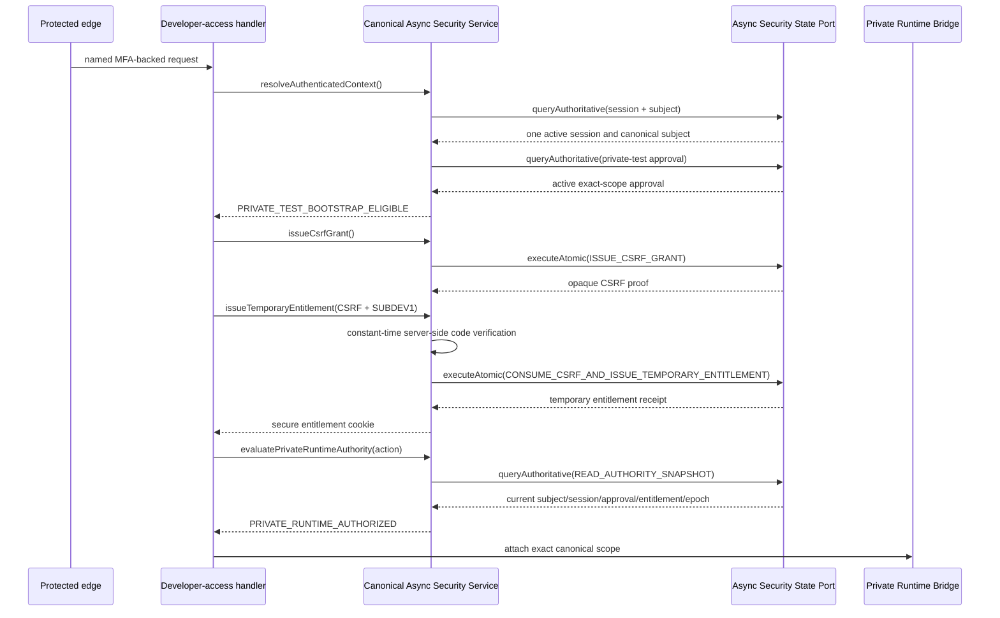
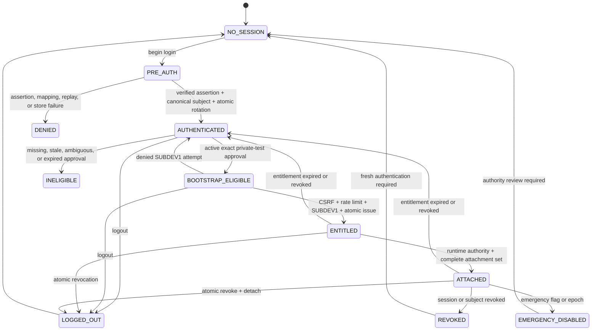
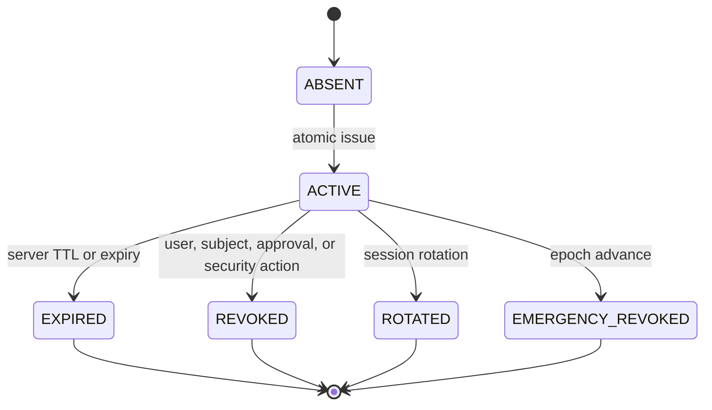
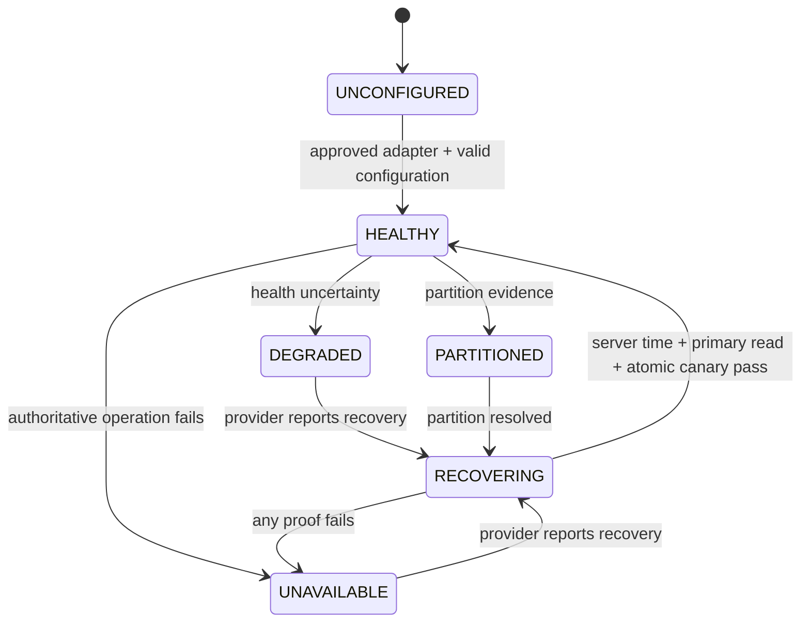

# MORE Private Runtime Async Security and Entitlement Bootstrap Architecture Repair V1

Mission ID:
`MORE_ARCHITECTURE_REPAIR_PRIVATE_RUNTIME_ASYNC_SECURITY_ENTITLEMENT_BOOTSTRAP_001`

Mission type: `TIER_1_ARCHITECTURE_REPAIR`

Repository:
`/Users/rrg/.openclaw/workspace/moremindmap-live`

Repository HEAD:
`46308958085fb84cd3ff6f2f081b8f2944774ecd`

Architecture date: `2026-07-27`

Implementation authorized: `false`

Deployment authorized: `false`

Staging authorized: `false`

Commit authorized: `false`

---

## 1. Executive summary

MORE MindMap will repair Private Runtime security around one versioned,
Promise-only **Canonical Async Security Service**.

The service will be the only security authority used by:

- subscriber authentication and canonical subject resolution;
- session creation, elevation, lookup, rotation, and revocation;
- private-tester eligibility;
- CSRF and replay protection;
- `SUBDEV1` temporary entitlement issuance, lookup, expiry, and revocation;
- private-runtime authority evaluation;
- security epochs, emergency disable, rate limiting, and security audit.

The service will consume one provider-neutral asynchronous state port. The port
will expose explicit authoritative queries and atomic security commands.
Network-backed adapters may implement those operations with transactions,
scripts, or another provider-native atomic mechanism. No caller may pretend a
remote operation is synchronous, authorize from a local cache, or silently
fall back to either existing in-memory store.

Developer access will no longer own a second security truth. A thin
Developer-Access Facade will project the existing route and cookie behavior
from the Canonical Async Security Service. It will not persist independent
capability, CSRF, replay, audit, or rate-limit records.

The `SUBDEV1` cycle will be removed by separating two decisions:

1. `PRIVATE_TEST_BOOTSTRAP_ELIGIBLE` proves that an already authenticated,
   canonically resolved subscriber may attempt the temporary private access
   flow. It grants no runtime authority.
2. `PRIVATE_RUNTIME_AUTHORIZED` is evaluated only after a valid temporary
   `SUBDEV1` entitlement exists.

The repaired sequence is:

```text
verified protected-edge identity
  -> verified subscriber authentication assertion
  -> canonical subject resolution
  -> active authenticated server session
  -> private-test bootstrap eligibility
  -> CSRF + rate limit + SUBDEV1 verification
  -> temporary subject/session/scope-bound entitlement
  -> private-runtime authority
  -> one canonical Business Engine attachment
  -> existing Subscription Runtime attachment
  -> existing text-based Coach Connect attachment
```

This repair does not change Business Engine, Five Futures, One Move, BA, BOS,
Profile ID, Subscription Runtime, Coach Connect, model routing, provider
selection, deployment architecture, Stripe, billing, public onboarding, voice,
media, Luna, transcripts, or product persistence.

Architecture verdict:

`PRIVATE_RUNTIME_ASYNC_SECURITY_ENTITLEMENT_ARCHITECTURE_REPAIRED`

---

## 2. Authoritative inputs and repository grounding

### 2.1 Reviewed inputs

| Input | SHA-256 |
|---|---|
| `COACH_CONNECT_PRIVATE_RUNTIME_ENABLEMENT_IMPLEMENTATION_REVIEW_V1.zip` | `c788ed458ced9e5ad81bc8c897760d96682bddfc08bfb3093186e1905aa27ac1` |
| `COACH_CONNECT_PRIVATE_LIVE_TEST_DEPLOYMENT_IMPLEMENTATION_REVIEW_V1.zip` | `c60caf3dcc2d8de8cb4dae2e4e3038ef4830d32d700eebbd7c2bab5facc6ec54` |
| `COACH_CONNECT_PRIVATE_RUNTIME_LIVE_WIRING_IMPLEMENTATION_REVIEW_V1.zip` | `faaae7a48937bca7e54cffa3889fb790f486cf5981e2063dcec8335505819dc8` |

The stopped live-wiring campaign’s root-cause receipt is:

`lab_outputs/coach_connect_private_runtime_live_wiring_v1/root_cause_receipt.json`

Its terminal stop condition was:

`DEPLOYMENT_GRADE_SHARED_STATE_AND_LIVE_ADAPTERS_CANNOT_BE_BOUND_WITHIN_EXISTING_NARROW_CONTRACTS`

### 2.2 Current handler evidence

The five private-runtime serverless handler factories default to an inactive
function and a null operation:

| Handler | Factory dependency | Current default |
|---|---|---|
| `api/internal/private-runtime-login.js` | `beginLogin`, `enabled` | null, `() => false` |
| `api/internal/private-runtime-callback.js` | `completeLogin`, `enabled` | null, `() => false` |
| `api/internal/private-runtime-session.js` | `inspectSession`, `enabled` | null, `() => false` |
| `api/internal/private-runtime-bootstrap.js` | `bootstrap`, `enabled` | null, `() => false` |
| `api/internal/private-runtime-logout.js` | `logout`, `enabled` | null, `() => false` |

`api/internal/developer-access.js` defaults to:

- `getDefaultDeveloperSecurityStore()`;
- `resolveCanonicalSubjectContext = null`;
- `resolvePrivateRuntimeAuthority = null`.

The default developer store is `InMemorySecurityStateStore`, whose capability
description is not deployment grade and is not shared across instances.

### 2.3 Current port evidence

Two security-store contracts exist:

1. `coachConnect/productionSecurity/sharedSecurityStatePorts.js` defines
   `SHARED_SECURITY_STATE_METHODS`.
2. `coachConnect/security/ports.js` defines `SECURITY_STATE_METHODS`.

They differ in names, records, clocks, CSRF handling, capability lookup, audit
methods, and method arguments.

All current call sites consume their results synchronously. Examples include:

- `sessionElevation.js` calls `atomicCreateSession`, `getSession`,
  `rotateSession`, and `revokeSession` without `await`;
- `requestIntegrity.js` calls `issueCsrfGrant` and `consumeCsrfGrant` without
  `await`;
- `abuseControls.js` maps synchronous `rateLimit` calls;
- `security/audit.js` calls `appendAudit` synchronously;
- `developer-access-security.js` calls `saveCapability` and
  `getCapabilityByTokenHash` synchronously;
- `developer-access.js` invokes both current resolvers synchronously.

The only repository security adapters are synthetic in-memory adapters:

- `InMemorySharedSecurityState`;
- `InMemorySecurityStateStore`.

Neither is deployment grade. Neither may become authoritative in Preview or
Production.

### 2.4 Existing runtime composition to preserve

`createCoachConnectPrivateRuntimeBridge` already composes:

1. `attachCanonicalBusinessEngine`;
2. `resolveEntitlement`;
3. `attachExistingSubscriptionRuntime`;
4. `resolveCoachState`;
5. `attachExistingCoachConnectRuntime`;
6. `validateCompleteAttachmentSet`.

The bridge already awaits the injected Business Engine, entitlement, and Coach
state resolvers. The existing attachment semantics do not need redesign.

---

## 3. Exact root causes

### 3.1 Root cause A — synchronous remote-state fiction

The current shared-security contract validates method presence but every
security-critical consumer treats results as immediate values.

A deployment-grade Redis, Upstash, database, or remote command service returns
Promises. A production adapter cannot truthfully conform to the present
contract without one of these prohibited behaviors:

- blocking the JavaScript process around network I/O;
- authorizing from process-local cached state;
- returning a Promise where callers expect a decision object;
- weakening atomicity into separate non-transactional calls;
- silently falling back to an in-memory store.

The repair must therefore be Promise-native from port through handler.

### 3.2 Root cause B — duplicate security contracts

Developer access stores temporary capabilities, CSRF grants, rate limits,
replay state, deletion epochs, and audit events in the older
`coachConnect/security` store.

Private-runtime authentication and authority use the separate
`productionSecurity` store for sessions, capabilities, replay state, rate
limits, security epochs, deletion epochs, leases, and audit receipts.

Adapting both stores independently to a live provider would produce two
authoritative security histories. Dual writes would introduce partial success,
split revocation, inconsistent restart recovery, and ambiguous audit.

The repair must create one canonical security decision path and one
authoritative record set.

### 3.3 Root cause C — `SUBDEV1` bootstrap authority cycle

Production developer access currently requires:

```text
resolvePrivateRuntimeAuthority(req).allowed = true
```

before the route can issue or verify the temporary developer capability.

The complete private-runtime authority decision requires an already valid
temporary entitlement capability.

That produces:

```text
need runtime authority to issue SUBDEV1
and
need SUBDEV1 to obtain runtime authority
```

The repair must define a pre-entitlement eligibility decision that is
deliberately weaker than runtime authority.

### 3.4 Root cause D — unbound default composition

The default handlers do not share one initialized composition root. Each
exports an unbound factory result. Environment variables can supply scalar
configuration but cannot inject executable resolvers or adapters.

The repair must provide one default composition object with explicit
`UNCONFIGURED` behavior. Absence of configuration remains a denial, but no
handler remains structurally unbound.

---

## 4. Architecture decision

### 4.1 Chosen approach

Adopt a **versioned Promise-only Canonical Async Security Service backed by an
atomic command/query port**.

This is preferred over converting every existing store method in place,
wrapping synchronous stores, or retaining two stores.

### 4.2 Why this approach

| Option | Decision | Reason |
|---|---|---|
| Convert both existing ports in place | Rejected | High regression risk; silently changes every existing synthetic caller and still leaves two truths |
| Async facade that wraps the current synchronous stores | Rejected for live use | Does not create deployment-grade atomicity and invites sync-over-async fiction |
| Separate developer and private-runtime live stores | Rejected | Duplicate security truth and split revocation |
| One transaction coordinator above both stores | Rejected as terminal design | Coordinates two authorities but cannot make remote cross-store operations atomic |
| New Promise-only canonical service and one atomic port | **Selected** | Explicit async semantics, one truth, provider-neutral operations, bounded compatibility |

### 4.3 Architectural layers

```text
serverless handlers
        |
        v
PrivateRuntimeLiveCompositionV2
        |
        +--> Subscriber Assertion Port
        |      provider-neutral, separately approved
        |
        +--> CanonicalAsyncSecurityServiceV2
        |             |
        |             v
        |     AsyncSecurityStatePortV2
        |       queryAuthoritative()
        |       executeAtomic()
        |       health()
        |       describeCapability()
        |       serverTime()
        |
        +--> existing Private Runtime Bridge
                   |
                   +--> canonical Business Engine port
                   +--> existing Subscription Runtime
                   +--> existing Coach Connect runtime
```

The canonical service owns security decisions. The adapter owns durable,
atomic, remote state mechanics. Handlers own HTTP parsing, headers, cookies,
and safe response shaping only.

---

## 5. Repaired call graph

### 5.1 Current call graph

```text
default login
  -> null beginLogin or disabled
  -> deny

default callback
  -> null completeLogin or disabled
  -> deny

default session
  -> null inspectSession or disabled
  -> deny

default bootstrap
  -> null bootstrap or disabled
  -> deny

default logout
  -> null logout or disabled
  -> deny

default developer access
  -> getDefaultDeveloperSecurityStore()
  -> InMemorySecurityStateStore
  -> null private-runtime authority
  -> Production environment denial

default subscription entitlement
  -> paid grant when no private-runtime decision, or
  -> developerAccessEnvironmentDecision()
  -> InMemorySecurityStateStore capability lookup
  -> Production environment denial without allowed private-runtime decision

private runtime bridge
  -> reachable only through injected test composition
```

### 5.2 Repaired call graph

```text
default login handler
  -> PrivateRuntimeLiveCompositionV2.beginLogin()
  -> CanonicalAsyncSecurityServiceV2.beginPreAuth()
  -> AsyncSecurityStatePortV2.executeAtomic(BEGIN_PRE_AUTH)

default callback handler
  -> SubscriberAssertionPort.verify()
  -> CanonicalAsyncSecurityServiceV2.completeAuthentication()
  -> query canonical subject
  -> executeAtomic(ELEVATE_SESSION)
  -> secure opaque session cookie

default developer-access handler
  -> CanonicalAsyncSecurityServiceV2.resolveAuthenticatedContext()
  -> evaluatePrivateTestEligibility()
  -> issue/consume CSRF
  -> verify SUBDEV1 server-side
  -> executeAtomic(CONSUME_CSRF_AND_ISSUE_TEMPORARY_ENTITLEMENT)
  -> secure entitlement cookie

default subscription-entitlement resolver for private-runtime request
  -> DeveloperAccessSecurityFacadeV2.inspectTemporaryEntitlement()
  -> CanonicalAsyncSecurityServiceV2.inspectTemporaryEntitlement()
  -> AsyncSecurityStatePortV2.queryAuthoritative(READ_AUTHORITY_SNAPSHOT)
  -> temporary unpaid subscription-entitlement projection

default session handler
  -> PrivateRuntimeLiveCompositionV2.inspectSession()
  -> CanonicalAsyncSecurityServiceV2.resolveAuthenticatedContext()
  -> CanonicalAsyncSecurityServiceV2.inspectTemporaryEntitlement()
  -> AsyncSecurityStatePortV2.queryAuthoritative(READ_AUTHORITY_SNAPSHOT)
  -> safe session and attachment receipts

default bootstrap handler
  -> PrivateRuntimeLiveCompositionV2.bootstrap()
  -> CanonicalAsyncSecurityServiceV2.evaluatePrivateRuntimeAuthority()
  -> AsyncSecurityStatePortV2.queryAuthoritative(READ_AUTHORITY_SNAPSHOT)
  -> existing Private Runtime Bridge
  -> one canonical Business Engine
  -> existing Subscription Runtime
  -> existing text Coach Connect

default logout handler
  -> PrivateRuntimeLiveCompositionV2.logout()
  -> CanonicalAsyncSecurityServiceV2.logout()
  -> AsyncSecurityStatePortV2.executeAtomic(REVOKE_RUNTIME_ACCESS)
  -> capability revoked
  -> session revoked
  -> security epoch advanced
  -> cookies cleared
  -> handles detached
```

No handler may call an adapter directly.

---

## 6. Async security architecture

### 6.1 Port version

New contract identifier:

`shared-security-state-async-v2`

The V2 port is additive. The current V1 ports remain unchanged during
transition and are explicitly synthetic-only.

### 6.2 Required V2 methods

```js
{
  describeCapability(): Promise<CapabilityDescription>,
  health(): Promise<HealthDecision>,
  serverTime(): Promise<ServerTimeReceipt>,
  queryAuthoritative(query): Promise<QueryResult>,
  executeAtomic(command): Promise<CommandResult>
}
```

Every method must return a Promise. A conformance probe must reject a
non-thenable result.

The small method surface is intentional:

- `queryAuthoritative` makes consistency level explicit;
- `executeAtomic` prevents application callers from inventing provider-specific
  transactions;
- adapter-specific scripts, transactions, locks, or conditional commands stay
  below the port;
- the service retains domain policy and validation;
- handlers never receive raw provider clients.

### 6.3 Capability description

```json
{
  "contract_version": "shared-security-state-async-v2",
  "adapter_id": "opaque-reviewed-adapter-reference",
  "adapter_class": "DEPLOYMENT_CANDIDATE_OR_APPROVED",
  "provider_class": "REMOTE_SHARED_SECURITY_STATE",
  "provider_name": "opaque-provider-identifier",
  "environment_id": "exact-private-environment",
  "available": true,
  "deployment_grade": true,
  "promise_native": true,
  "authoritative_reads": "PRIMARY_OR_LINEARIZABLE",
  "atomic_command_model": "PROVIDER_NATIVE_TRANSACTION_OR_SCRIPT",
  "server_time_ttl": true,
  "durable_security_records": true,
  "durable_privacy_safe_audit": true,
  "restart_safe": true,
  "outage_behavior": "FAIL_CLOSED",
  "partition_behavior": "FAIL_CLOSED",
  "no_local_fallback": true,
  "stores_product_content": false,
  "stores_transcripts": false,
  "stores_raw_identity_material": false,
  "live_connection_verified": false
}
```

The structural port validator is provider-neutral. It must not hardcode
Upstash, Redis, Auth0, Vercel, or any vendor.

A separate deployment policy may compare `adapter_id` and its signed
attestation to the currently ratified provider decision. That policy does not
change the core port.

### 6.4 Authoritative query types

| Query | Purpose | Required consistency |
|---|---|---|
| `RESOLVE_CANONICAL_SUBJECT` | Resolve exact immutable external subject mapping | Primary/linearizable |
| `RESOLVE_EXACT_SCOPE` | Detect scope-to-subject ambiguity | Primary/linearizable |
| `GET_SESSION_BY_TOKEN_HASH` | Inspect active authenticated session | Primary/linearizable |
| `GET_TEMPORARY_ENTITLEMENT_BY_TOKEN_HASH` | Inspect temporary entitlement | Primary/linearizable |
| `GET_PRIVATE_TEST_APPROVAL` | Read current eligibility approval | Primary/linearizable |
| `READ_AUTHORITY_SNAPSHOT` | Read subject, session, approval, entitlement, and epoch as one consistent authority snapshot | Primary/linearizable |
| `GET_SECURITY_EPOCH` | Read environment/scope revocation epoch | Primary/linearizable |
| `GET_REPLAY_RESULT` | Recover completed idempotent command | Primary/linearizable |

`READ_AUTHORITY_SNAPSHOT` is the required source for runtime access. Runtime
authority may not be composed from unrelated cached reads.

### 6.5 Atomic command types

| Command | Atomic effects |
|---|---|
| `BIND_APPROVED_CANONICAL_SUBJECT` | Assert unused immutable subject and unused exact scope; create mapping; append receipt |
| `BEGIN_PRE_AUTH` | Create pre-auth session, nonce/state references, TTL, and audit receipt |
| `ELEVATE_AUTHENTICATED_SESSION` | Consume pre-auth state, reject replay, rotate session, invalidate prior CSRF/capabilities, append audit |
| `ISSUE_CSRF_GRANT` | Create single-use subject/session/browser/route-bound CSRF grant |
| `CONSUME_CSRF_AND_ISSUE_TEMPORARY_ENTITLEMENT` | Consume CSRF, apply rate-limit result, revalidate subject/session/approval/epoch, issue hashed capability with TTL, append audit |
| `CLAIM_REPLAY` | Atomically claim idempotency key and fingerprint |
| `COMPLETE_REPLAY` | Bind claim to content-free result reference |
| `REVOKE_TEMPORARY_ENTITLEMENT` | Mark entitlement revoked and append audit |
| `REVOKE_RUNTIME_ACCESS` | Revoke entitlement and session, advance epoch, invalidate CSRF, append logout receipt |
| `ADVANCE_SECURITY_EPOCH` | Compare-and-set epoch and append emergency/revocation receipt |
| `APPLY_RATE_LIMIT` | Increment distributed counter and return allow/deny with server-time reset |
| `APPEND_SECURITY_AUDIT` | Append a unique privacy-safe denial or observation receipt |

An allowed mutation is not successful unless its mandatory audit receipt is
committed in the same provider atomic boundary.

Denied requests remain denied if denial-audit append is unavailable. The
service emits a safe monitoring failure and never converts audit failure into
access.

### 6.6 Security-domain coverage

| Required domain | Canonical V2 operation |
|---|---|
| Subject binding | `RESOLVE_CANONICAL_SUBJECT`, `RESOLVE_EXACT_SCOPE`, and separately governed `BIND_APPROVED_CANONICAL_SUBJECT` |
| Session elevation | `BEGIN_PRE_AUTH` followed by atomic `ELEVATE_AUTHENTICATED_SESSION` |
| Capability issuance | `CONSUME_CSRF_AND_ISSUE_TEMPORARY_ENTITLEMENT` |
| Capability lookup | `GET_TEMPORARY_ENTITLEMENT_BY_TOKEN_HASH` only through an authority snapshot |
| CSRF grants | `ISSUE_CSRF_GRANT` and atomic single-use consumption |
| Replay protection | `CLAIM_REPLAY`, `COMPLETE_REPLAY`, nonce consumption, and idempotent result lookup |
| Revocation | `REVOKE_TEMPORARY_ENTITLEMENT`, `REVOKE_RUNTIME_ACCESS`, and epoch advancement |
| Security epochs | primary-consistent `GET_SECURITY_EPOCH` plus compare-and-set `ADVANCE_SECURITY_EPOCH` |
| Audit append | mandatory same-transaction allow receipts and privacy-safe denial receipts |
| Rate limiting | distributed, server-time-based `APPLY_RATE_LIMIT` |
| Restart recovery | authoritative session, entitlement, approval, mapping, and epoch reads |
| Outage behavior | deny on timeout, rejection, ambiguity, degradation, partition, or recovery state |

### 6.7 Security data allowed in the state store

Allowed:

- opaque external-subject mapping references;
- canonical subject and exact-scope references;
- private-test approval references and expiry;
- hashed session and entitlement tokens;
- pre-auth/session/entitlement status and TTL;
- CSRF, nonce, replay, rate-limit, and epoch state;
- privacy-safe security and attachment receipts.

Forbidden:

- raw access codes;
- raw tokens, assertions, cookies, or credentials;
- names, email addresses, raw network addresses, or physical addresses;
- Business Engine payloads;
- BA, BOS, Five Futures, or One Move content;
- model prompts or outputs;
- Coach Connect private content, transcripts, voice, or media;
- Stripe or billing records;
- production customer records.

---

## 7. Canonical security authority

### 7.1 Service version

New contract identifier:

`private-runtime-canonical-security-service-v2`

### 7.2 Service methods

```js
{
  describe(): Promise<ServiceDescription>,
  health(): Promise<HealthDecision>,
  beginPreAuth(input): Promise<PreAuthDecision>,
  completeAuthentication(input): Promise<AuthenticationDecision>,
  resolveAuthenticatedContext(requestContext): Promise<AuthenticatedContextDecision>,
  evaluatePrivateTestEligibility(authenticatedContext): Promise<EligibilityDecision>,
  issueCsrfGrant(authenticatedContext, intent): Promise<CsrfDecision>,
  issueTemporaryEntitlement(input): Promise<EntitlementDecision>,
  inspectTemporaryEntitlement(requestContext): Promise<EntitlementDecision>,
  evaluatePrivateRuntimeAuthority(input): Promise<RuntimeAuthorityDecision>,
  revokeTemporaryEntitlement(input): Promise<RevocationDecision>,
  logout(input): Promise<LogoutDecision>,
  inspectRecovery(input): Promise<RecoveryDecision>
}
```

The service is the only caller of `AsyncSecurityStatePortV2`.

### 7.3 Authority invariants

The service must prove:

- exactly one active external subject maps to one canonical subject and exact
  scope;
- no runtime route can create a mapping;
- email, Profile ID, browser input, request body, `SUBDEV1`, or a developer
  capability cannot establish identity;
- session tokens and entitlement tokens are independently rotated and hashed;
- private-test approval is independent of authentication and entitlement;
- entitlement never grants identity, admin, operator, deployment, billing,
  coach, or canonical authority;
- all runtime authority is derived from one authoritative snapshot;
- every allow decision includes the current security epoch;
- emergency disable dominates every allow decision;
- missing, stale, ambiguous, unavailable, degraded, or partitioned state
  denies.

### 7.4 One security truth

The canonical store owns one record for each security fact:

| Security fact | Canonical V2 record |
|---|---|
| External subject mapping | `CanonicalSubjectMappingV1` |
| Authenticated session | `AuthenticatedSubscriberSessionV1` |
| Private tester approval | `PrivateTestApprovalV1` |
| Temporary entitlement | `TemporaryPrivateEntitlementV2` |
| CSRF grant | `CsrfGrantV2` |
| Replay claim | `SecurityReplayClaimV2` |
| Rate limit | `SecurityRateLimitV2` |
| Security epoch | `SecurityEpochV1` |
| Audit | `PrivacySafeSecurityAuditV2` |

Developer access does not own copies of these records.

---

## 8. Developer-access security unification

### 8.1 Decision

Developer access will consume the same Canonical Async Security Service through
one thin `DeveloperAccessSecurityFacadeV2`.

The facade is a route compatibility boundary, not a state adapter.

### 8.2 Facade responsibilities

Permitted:

- translate GET into authenticated context, eligibility, entitlement
  inspection, and CSRF issuance;
- translate POST into CSRF consumption, rate limiting, server-side access-code
  verification, and temporary entitlement issuance;
- translate DELETE into entitlement revocation;
- retain current safe cookie names and safe response shape;
- project the canonical V2 entitlement into the existing
  `more_monthly_intelligence` response.

Forbidden:

- owning a store;
- writing a second capability record;
- maintaining local CSRF, replay, audit, rate-limit, or revocation state;
- returning raw capability or token material in JSON;
- evaluating runtime authority before authentication;
- treating eligibility as runtime access.

### 8.3 Legacy store disposition

`InMemorySecurityStateStore` remains available only for existing V1 synthetic
tests during migration.

It must be marked:

```json
{
  "contract_version": "developer-security-state-sync-v1",
  "runtime_class": "SYNTHETIC_TEST_ONLY",
  "preview_authorized": false,
  "production_authorized": false
}
```

The default serverless handler must never import or instantiate it after V2
cutover.

---

## 9. Non-circular `SUBDEV1` bootstrap

### 9.1 Three distinct decisions

#### A. Authentication decision

Proves:

- protected-edge identity is present and MFA-backed;
- a subscriber assertion is verified;
- one pre-existing canonical subject is resolved;
- one active server-owned session exists.

Grants:

- authenticated subscriber context only.

Does not grant:

- private-test eligibility;
- entitlement;
- runtime access;
- product or canonical authority.

#### B. Private-test bootstrap eligibility decision

Proves:

- authentication decision remains current;
- exact environment, subject, and scope are allowlisted;
- one active private-tester approval exists;
- approval purpose and expiry are valid;
- shared-state health is authoritative;
- emergency disable is false;
- public access and paid entitlement remain false.

Grants:

- permission to request a CSRF grant and attempt `SUBDEV1`.

Does not grant:

- Subscription Runtime access;
- Coach Connect access;
- Business Engine attachment;
- administrator, operator, deployment, billing, coach, or canonical authority.

#### C. Private-runtime authority decision

Proves:

- current authentication decision;
- current eligibility decision;
- active temporary `SUBDEV1` entitlement;
- matching subject, session, browser, environment, scope, security version,
  and epoch;
- unexpired entitlement;
- allowlisted runtime and action;
- healthy shared state;
- emergency disable remains false.

Grants:

- one exact runtime action for one exact authority snapshot.

### 9.2 Bootstrap sequence



### 9.3 Eligibility decision schema

```json
{
  "decision_version": "private-test-bootstrap-eligibility-v1",
  "allowed": true,
  "code": null,
  "environment_id": "opaque",
  "subscriber_subject_ref": "opaque",
  "authenticated_session_ref": "opaque",
  "exact_scope_hash": "sha256",
  "approval_ref": "opaque",
  "security_epoch": 1,
  "evaluated_at": "timestamp",
  "expires_at": "timestamp",
  "may_attempt_subdev1": true,
  "runtime_access": false,
  "admin_authority": false,
  "operator_authority": false,
  "deployment_authority": false,
  "billing_authority": false,
  "coach_authority": false,
  "canonical_mutation_authority": false
}
```

### 9.4 Temporary entitlement schema

```json
{
  "record_version": "temporary-private-entitlement-v2",
  "entitlement_id": "opaque",
  "environment_id": "opaque",
  "subscriber_subject_ref": "opaque",
  "authenticated_session_ref": "opaque",
  "browser_binding_hash": "sha256",
  "exact_scope_hash": "sha256",
  "subject_security_version": 1,
  "session_epoch": 1,
  "source": "temporary_internal_subscription_entitlement",
  "access_type": "more_monthly_intelligence",
  "status": "ACTIVE",
  "issued_at": "timestamp",
  "expires_at": "timestamp",
  "temporary": true,
  "paid_entitlement": false,
  "billing_evidence": false,
  "stripe_subscription_created": false,
  "admin_authority": false,
  "operator_authority": false,
  "deployment_authority": false,
  "billing_authority": false,
  "coach_authority": false,
  "canonical_mutation_authority": false
}
```

Only the token hash is stored. The browser receives the raw opaque token in an
HttpOnly, Secure, SameSite=Strict cookie.

### 9.5 Runtime authority schema

```json
{
  "decision_version": "private-runtime-authority-decision-v2",
  "allowed": true,
  "code": null,
  "authority_fingerprint": "sha256",
  "environment_id": "opaque",
  "subscriber_subject_ref": "opaque",
  "authenticated_session_ref": "opaque",
  "entitlement_ref": "opaque",
  "exact_scope_hash": "sha256",
  "security_epoch": 1,
  "requested_runtime": "BUSINESS_ENGINE_OR_SUBSCRIPTION_RUNTIME_OR_COACH_CONNECT",
  "requested_action": "allowlisted-action",
  "evaluated_at": "timestamp",
  "expires_at": "timestamp",
  "deployment_grade_security_state": true,
  "no_local_fallback": true,
  "admin_authority": false,
  "operator_authority": false,
  "deployment_authority": false,
  "billing_authority": false,
  "coach_authority": false,
  "canonical_mutation_authority": false
}
```

---

## 10. State machines

### 10.1 Authentication and runtime state



### 10.2 Temporary entitlement state



Terminal entitlement records cannot be reactivated. A new entitlement receives
a new identifier and token hash.

### 10.3 Shared-state health



Only `HEALTHY` can authenticate, issue CSRF, issue entitlement, or authorize a
runtime action.

---

## 11. Session and entitlement lifecycle

### 11.1 Initial authentication

1. Validate protected-edge named identity and MFA receipt.
2. Validate configuration and emergency-disable state.
3. Query service health and authoritative server time.
4. Create one unprivileged pre-auth session atomically.
5. Use the separately approved provider-neutral assertion port.
6. Resolve one pre-existing canonical subject.
7. Deny unknown or ambiguous mapping; never auto-enroll.
8. Atomically rotate pre-auth into a server-owned authenticated session.
9. Set only the opaque `__Host-more_session` cookie.

### 11.2 Canonical subject mapping

Runtime handlers are read-only with respect to identity mapping.

`BIND_APPROVED_CANONICAL_SUBJECT` is permitted only in a separately governed
enrollment workflow with explicit subscriber confirmation and approval. It is
not available to login, developer access, bootstrap, Subscription Runtime, or
Coach Connect.

### 11.3 Private-test allowlist

Eligibility requires both:

- exact environment/subject/scope activation configuration; and
- an active `PrivateTestApprovalV1` record in canonical security state.

Configuration alone is insufficient. Approval alone is insufficient.

### 11.4 Entitlement issuance

1. Re-resolve authenticated context.
2. Re-evaluate eligibility.
3. Consume a single-use CSRF grant.
4. Apply canonical distributed rate limits.
5. Compare `SUBDEV1` server-side in constant time.
6. Never log, store, echo, or receipt the access code.
7. Atomically revalidate subject, session, approval, scope, and epoch.
8. Persist one token hash and temporary entitlement.
9. Append one privacy-safe issuance audit.
10. Set the secure entitlement cookie.

### 11.5 Expiry and revocation

The entitlement expires at the earliest of:

- its configured maximum TTL;
- authenticated-session expiry;
- private-tester approval expiry;
- environment activation expiry.

Revocation may occur from:

- explicit DELETE on developer access;
- logout;
- session rotation;
- subject disable/recovery;
- private-tester approval revocation;
- emergency epoch advance.

### 11.6 Session rotation

Rotation:

- changes the authenticated session identifier and token hash;
- invalidates prior CSRF grants;
- rotates or revokes temporary entitlement;
- preserves the canonical subject mapping;
- requires a new entitlement attempt;
- never replays a prior raw token.

### 11.7 Logout

When shared state is healthy, logout atomically:

1. revokes the temporary entitlement;
2. revokes the authenticated session;
3. advances the security epoch;
4. invalidates CSRF;
5. appends the logout receipt;
6. detaches runtime handles;
7. clears both cookies.

If shared state is unavailable:

- clear browser cookies immediately;
- deny every runtime request because authority cannot be read;
- return a safe `LOGOUT_REVOCATION_UNCONFIRMED` failure;
- do not claim server-side revocation;
- do not create a local revocation queue or fallback;
- require a fresh authenticated session after recovery.

### 11.8 Restart recovery

After process restart:

1. construct the V2 composition from reviewed scalar configuration;
2. validate adapter contract version and configuration digest;
3. validate health, primary reads, and server time;
4. hash the presented opaque cookies;
5. read one authoritative authority snapshot;
6. revalidate subject, session, approval, entitlement, epoch, and action;
7. rebuild existing runtime attachments from canonical references;
8. publish readiness only after all attachment receipts agree.

No process-local snapshot is authoritative.

### 11.9 Shared-state outage

During `DEGRADED`, `UNAVAILABLE`, `PARTITIONED`, or `RECOVERING`:

- no new login;
- no callback elevation;
- no CSRF issue or consumption;
- no `SUBDEV1` issuance;
- no session continuation;
- no runtime attachment or interaction;
- no local cache authorization;
- no fallback to V1 stores.

### 11.10 Emergency disable

Two independent controls apply:

1. a default-on configuration kill switch checked before any allow decision;
2. an authoritative environment/scope security epoch checked in every
   authority snapshot.

The configuration kill switch denies immediately even during store outage.
When the store is healthy, an authorized operator command advances the epoch
to revoke current sessions and entitlements.

`SUBDEV1` has no ability to change either control.

---

## 12. Existing runtime attachment

The repaired security service ends at an exact runtime-authority decision.

It then supplies the existing bridge:

```text
PrivateRuntimeAuthorityDecisionV2
  -> existing attachCanonicalBusinessEngine()
  -> existing attachExistingSubscriptionRuntime()
  -> existing attachExistingCoachConnectRuntime()
  -> existing validateCompleteAttachmentSet()
```

The following remain unchanged:

- canonical Business Engine lookup and one-engine validation;
- Business Engine reference/version/hash contracts;
- Profile ID;
- Subscription Runtime commands, queries, activation, and model routing;
- Coach Connect relationship, consent, proposal, confirmation, projection,
  and promotion semantics;
- text-only private Coach Connect capability;
- attachment receipt versions unless a later compatibility test proves a
  version field is required.

No security service may build, copy, mutate, or own a Business Engine.

---

## 13. Compatibility and migration

### 13.1 Additive version boundary

V2 is additive:

- V1 synchronous ports remain for existing synthetic tests.
- V2 uses new filenames, contract versions, and imports.
- No V1 object may pass V2 validation.
- No V2 handler may fall back to V1.
- No mixed sync/async composition is valid.

### 13.2 Promise enforcement

Every V2 method call is awaited.

Conformance tests must prove:

- each port method returns a thenable;
- a synchronous return is rejected;
- an unresolved, rejected, timed-out, or malformed Promise denies;
- handler response cannot be sent before the security Promise settles;
- no `Promise` object is mistaken for an allow decision.

### 13.3 Synthetic adapter

A new `SyntheticAsyncSecurityStateAdapterV2` may be implemented for offline
tests.

It must:

- implement the Promise-only V2 contract directly;
- model atomic commands against one shared synthetic backend;
- support snapshot/restart proofs;
- report `deployment_grade: false`;
- report `live_connection_verified: false`;
- be rejected in Preview and Production.

It must not wrap a V1 store and then claim V2 deployment capability.

### 13.4 No dual-write migration

No live V1 security state exists, so the cutover requires no production data
migration.

The future implementation and deployment sequence is:

1. implement V2 contracts and synthetic adapter;
2. migrate tests and handlers to V2 behind source-default-off configuration;
3. qualify one separately reviewed remote adapter;
4. deploy to an empty isolated V2 security namespace;
5. enable only after health and conformance proof.

Do not dual write V1 and V2. Do not read V1 on V2 miss.

### 13.5 Deprecation plan

Phase 1:

- retain all V1 exports and tests;
- add V2 exports;
- mark V1 stores synthetic-only.

Phase 2:

- move default private-runtime handlers and developer access to V2;
- keep named V1 factory tests explicit;
- prove no default import reaches a V1 store.

Phase 3:

- after V2 regression and private-live proof, deprecate V1 developer-access
  store imports;
- remove V1 only in a separately reviewed cleanup campaign.

### 13.6 Rollback

Rollback never falls back to V1.

Rollback:

- asserts V2 emergency disable;
- disables the default live composition;
- clears client cookies;
- preserves V2 remote security records until TTL/retention expiry;
- reverts to inaccessible default-off handlers;
- preserves canonical subject and Business Engine state;
- performs no destructive deletion or migration.

---

## 14. Exact affected files

This is the proposed implementation allowlist for a later AFW. It is not
implementation authority.

### 14.1 New production-security files

```text
src/lib/intelligenceFabric/coachConnect/productionSecurity/asyncSharedSecurityStatePort.js
src/lib/intelligenceFabric/coachConnect/productionSecurity/syntheticAsyncSecurityStateAdapter.js
src/lib/intelligenceFabric/coachConnect/productionSecurity/asyncSecurityContracts.js
```

### 14.2 New private-runtime files

```text
src/lib/intelligenceFabric/coachConnect/privateRuntime/canonicalAsyncSecurityService.js
src/lib/intelligenceFabric/coachConnect/privateRuntime/developerAccessSecurityFacade.js
src/lib/intelligenceFabric/coachConnect/privateRuntime/liveComposition.js
src/lib/intelligenceFabric/coachConnect/privateRuntime/eligibility.js
```

### 14.3 Existing files expected to change

```text
api/internal/developer-access.js
api/internal/developer-access-security.js
api/internal/subscription-entitlement.js
api/internal/private-runtime-login.js
api/internal/private-runtime-callback.js
api/internal/private-runtime-session.js
api/internal/private-runtime-bootstrap.js
api/internal/private-runtime-logout.js
src/lib/intelligenceFabric/coachConnect/productionSecurity/index.js
src/lib/intelligenceFabric/coachConnect/privateRuntime/index.js
```

Permitted changes are limited to:

- V2 exports;
- Promise-aware handler composition;
- the canonical service and facade;
- phase-correct eligibility, entitlement, and authority calls;
- source-default-off composition;
- safe response and cookie behavior.

### 14.4 V1 files to annotate but not semantically convert

```text
src/lib/intelligenceFabric/coachConnect/productionSecurity/sharedSecurityStatePorts.js
src/lib/intelligenceFabric/coachConnect/productionSecurity/inMemorySharedSecurityState.js
src/lib/intelligenceFabric/coachConnect/security/ports.js
src/lib/intelligenceFabric/coachConnect/security/inMemorySecurityStateStore.js
```

Only explicit V1 synthetic-only metadata and deprecation notices are permitted
in these files. Their method semantics stay synchronous for compatibility.

### 14.5 Files consumed unchanged

```text
src/lib/intelligenceFabric/coachConnect/productionSecurity/contracts.js
src/lib/intelligenceFabric/coachConnect/productionSecurity/subjectBinding.js
src/lib/intelligenceFabric/coachConnect/productionSecurity/sessionElevation.js
src/lib/intelligenceFabric/coachConnect/privateRuntime/activation.js
src/lib/intelligenceFabric/coachConnect/privateRuntime/attachments.js
src/lib/intelligenceFabric/coachConnect/privateRuntime/authority.js
src/lib/intelligenceFabric/coachConnect/privateRuntime/composition.js
src/lib/intelligenceFabric/coachConnect/privateRuntime/contracts.js
src/lib/intelligenceFabric/coachConnect/privateRuntime/evidence.js
src/lib/intelligenceFabric/coachConnect/privateRuntime/sessionResolver.js
```

Their existing V1 functions remain available to current tests. V2 behavior is
implemented in the new modules rather than silently changing sync semantics.

### 14.6 Test and verification candidates

```text
test/intelligenceFabric.coachConnect.privateRuntime.asyncSecurity.contracts.test.js
test/intelligenceFabric.coachConnect.privateRuntime.asyncSecurity.developerAccess.test.js
test/intelligenceFabric.coachConnect.privateRuntime.asyncSecurity.entitlement.test.js
test/intelligenceFabric.coachConnect.privateRuntime.asyncSecurity.handlers.test.js
test/intelligenceFabric.coachConnect.privateRuntime.asyncSecurity.integration.test.js
test/intelligenceFabric.coachConnect.privateRuntime.asyncSecurity.recovery.test.js
test/intelligenceFabric.coachConnect.privateRuntime.asyncSecurity.adversarial.test.js
scripts/verifyCoachConnectPrivateRuntimeAsyncSecurityRepair.mjs
lab_outputs/coach_connect_private_runtime_async_security_repair_v1/**
```

### 14.7 Provider adapter boundary

No provider adapter file is authorized by this architecture packet.

A real remote adapter requires a separate exact AFW naming:

- adapter source path;
- provider and version;
- atomic command implementation;
- credential owner;
- isolated namespace;
- health and backup evidence;
- activation and rollback owner;
- no-local-fallback proof.

The async port and synthetic adapter may be implemented and tested without
credentials or provider activation.

---

## 15. Affected imports and handlers

### 15.1 Default handler import rule

All seven default route surfaces import one composition accessor:

```text
getPrivateRuntimeLiveCompositionV2()
```

The accessor returns either:

- a fully validated V2 composition; or
- an explicit frozen `UNCONFIGURED` composition whose methods asynchronously
  deny.

It never returns null and never instantiates a V1 store.

### 15.2 Developer-access import transition

Current imports from:

```text
coachConnect/security/index.js
developer-access-security.js default store
```

move behind:

```text
privateRuntime/developerAccessSecurityFacade.js
privateRuntime/canonicalAsyncSecurityService.js
```

The safe cookie and privacy-response utilities may remain shared, but their
state mutations must route through the canonical service.

### 15.3 Subscription entitlement transition

`resolveSubscriptionEntitlement` becomes Promise-based for private-runtime
requests and projects from `TemporaryPrivateEntitlementV2`.

The existing paid-access branch remains untouched and must be unreachable when
a private-runtime context is present.

### 15.4 Existing tests

Existing synchronous V1 tests continue importing named V1 factories and
stores. New V2 tests import only V2 contracts and the synthetic async adapter.

No test may pass a V1 store into a V2 service.

---

## 16. Protected roots

The implementation must not modify:

- `src/lib/businessEngine/**`;
- `src/lib/businessAssessment/**`;
- `api/engine/**`;
- `api/business-assessment/**`;
- BA or BOS scoring and canonical artifacts;
- Five Futures or One Move contracts, state machines, authority, or
  projections;
- Profile ID generation, lookup, validation, or semantics;
- canonical dossier or canonical event semantics;
- `src/lib/intelligenceFabric/production/**`;
- `src/lib/intelligenceFabric/coachConnect/activation.js`;
- `src/lib/intelligenceFabric/coachConnect/contracts.js`;
- `src/lib/intelligenceFabric/coachConnect/service.js`;
- `src/lib/intelligenceFabric/coachConnect/stateMachines.js`;
- `src/lib/intelligenceFabric/coachConnect/projections.js`;
- `src/lib/intelligenceFabric/coachConnect/liveSession/**`;
- `src/lib/intelligenceFabric/coachConnect/internalDeployment/**`;
- `src/lib/intelligenceFabric/coachConnect/deploymentReadiness/**`;
- provider adapters without a separate exact AFW;
- `api/stripe/**` or `src/lib/stripe/**`;
- `vercel.json`;
- package manifests or lockfiles;
- public UI, public routes, registration, onboarding, pricing, billing, model
  selection, Luna, voice, or media configuration.

The future implementation may consume protected exports. It may not change
their semantics.

---

## 17. Seven-sprint implementation structure

Every sprint requires its own exact allowlist, test gate, protected-root
comparison, secret scan, and zero-provider-call proof. At most two bounded
repairs are permitted per failed sprint gate.

### Sprint 1 — Async Shared-Security Contract

Deliver:

- V2 Promise-only port;
- authoritative query and atomic command schemas;
- V2 contract validation;
- synthetic async adapter;
- provider-neutral capability attestation.

Prove:

- every method is awaited;
- synchronous returns fail;
- atomic command semantics;
- in-memory V2 adapter remains non-deployment-grade;
- outage, partition, timeout, malformed response, and clock ambiguity deny;
- zero provider calls.

### Sprint 2 — Developer-Access Security Unification

Deliver:

- Developer-Access Facade V2;
- one canonical capability, CSRF, replay, rate-limit, and audit path;
- no default V1 store import.

Prove:

- no duplicate capability record;
- GET/POST/DELETE use one service;
- CSRF is single-use;
- rate limiting is distributed by contract;
- entitlement lookup and revocation use one truth;
- existing safe cookie and response behavior remain compatible.

### Sprint 3 — Canonical Subject and Private-Test Eligibility

Deliver:

- async authenticated-context resolution;
- pre-existing canonical subject query;
- `PrivateTestBootstrapEligibilityV1`;
- exact private approval query.

Prove:

- unknown and ambiguous subject deny;
- no auto-enrollment;
- Profile ID, email, browser value, body, `SUBDEV1`, and developer capability
  cannot establish identity;
- eligibility grants no runtime authority;
- one subject and one exact scope.

### Sprint 4 — `SUBDEV1` Entitlement Bootstrap

Deliver:

- phase-separated bootstrap flow;
- atomic CSRF consume and temporary entitlement issuance;
- temporary entitlement projection for existing subscription response.

Prove:

- authentication precedes eligibility;
- eligibility precedes entitlement;
- entitlement precedes runtime authority;
- no authority cycle;
- code never enters logs, persistence, response, or evidence;
- all non-subscription authority fields are false;
- Stripe and paid entitlement remain off.

### Sprint 5 — Session, Revocation, and Recovery

Deliver:

- Promise-native session inspection and rotation;
- entitlement expiry and revocation;
- atomic logout;
- epoch-based emergency disable;
- restart recovery.

Prove:

- restart reads authoritative remote-shaped state;
- no local fallback;
- rotation invalidates CSRF and entitlement;
- logout cannot falsely claim revocation during outage;
- emergency disable dominates;
- stale epoch, session, approval, or entitlement denies.

### Sprint 6 — Live Handler Composition

Deliver:

- one default V2 composition accessor;
- bound login, callback, session, bootstrap, logout, developer-access, and
  subscription-entitlement handlers;
- explicit unconfigured async denial.

Prove:

- handlers are structurally bound but source-default-off;
- no handler directly calls an adapter;
- every security operation is awaited;
- missing configuration denies;
- existing bridge attaches one Business Engine and existing runtimes;
- no source change is required later to supply approved scalar configuration
  and an already-implemented reviewed adapter.

### Sprint 7 — Cross-System Validation

Deliver:

- complete authority and lifecycle proof;
- regression and evidence manifests;
- executive and AI handoffs;
- implementation review package.

Prove:

- one canonical security truth;
- no authority cycle;
- no mixed sync/async execution;
- no duplicate subject, engine, subscription runtime, or Coach Connect runtime;
- no provider, Stripe, voice, Luna, transcript, production persistence,
  deployment, migration, or destructive deletion action;
- protected roots unchanged.

---

## 18. Validation plan

### 18.1 Contract validation

Required:

- V2 schema validation for every query, command, record, and receipt;
- Promise/thenable conformance;
- exact contract version rejection;
- exact field allowlists;
- safe failure-code allowlists;
- provider-neutral capability description;
- no unknown authority-bearing fields.

### 18.2 Authority-order proofs

The verifier must model the graph:

```text
EDGE_ATTESTED
  -> AUTHENTICATED
  -> CANONICAL_SUBJECT_RESOLVED
  -> BOOTSTRAP_ELIGIBLE
  -> TEMPORARY_ENTITLEMENT_ACTIVE
  -> PRIVATE_RUNTIME_AUTHORIZED
  -> ATTACHED
```

It must reject every edge that skips a state or points backward.

Specifically:

- `SUBDEV1 -> AUTHENTICATED` is forbidden;
- `ELIGIBLE -> ATTACHED` is forbidden;
- `AUTHENTICATED -> PRIVATE_RUNTIME_AUTHORIZED` is forbidden;
- `PAID_ENTITLEMENT -> PRIVATE_RUNTIME_AUTHORIZED` is forbidden in the private
  path;
- `PRIVATE_RUNTIME_AUTHORIZED -> OPERATOR` is forbidden.

### 18.3 Atomicity tests

Test:

- two subjects competing for one scope;
- one subject competing for two scopes;
- two concurrent pre-auth rotations;
- two concurrent CSRF consumes;
- two concurrent entitlement issues;
- entitlement issue racing approval revocation;
- runtime read racing epoch advance;
- logout racing runtime action;
- replay claim collision;
- rate-limit updates across two service instances;
- audit append failure during an allow mutation.

Exactly one valid authority outcome may survive each race.

### 18.4 Failure matrix

Test:

- unconfigured adapter;
- adapter contract mismatch;
- synchronous adapter passed as V2;
- Promise rejection;
- timeout;
- malformed provider response;
- degraded, unavailable, partitioned, and recovering state;
- stale primary read;
- invalid server time;
- missing mapping;
- ambiguous mapping;
- disabled subject;
- expired session;
- expired approval;
- expired or revoked entitlement;
- browser, session, subject, scope, environment, or epoch mismatch;
- emergency disable;
- partial attachment.

Every case denies without a local fallback.

### 18.5 Regression suites

Run:

- all new async-security suites;
- full Private Runtime Enablement suite;
- existing developer-access tests;
- security and production-security suites;
- Subscription Runtime regressions;
- Coach Connect and Live Session regressions;
- Production Security Prerequisite regressions;
- Deployment Readiness regressions;
- safe complete Intelligence Fabric regression;
- deterministic build;
- focused lint;
- import/export checks;
- dependency-cycle checks;
- schema validation;
- secret and sensitive-content scans;
- exact changed-file allowlist;
- protected-root comparison;
- evidence-manifest and archive integrity validation.

### 18.6 Mandatory zero-call proof

Implementation validation must record zero:

- Auth0 calls;
- Redis or Upstash calls;
- Vercel calls;
- model-provider calls;
- media or voice calls;
- Luna calls;
- transcript-persistence calls;
- production-persistence calls;
- Stripe calls;
- deployment calls.

Only synthetic async adapters are permitted during implementation validation.

---

## 19. Architectural invariant proof

| Required proof | Architectural mechanism |
|---|---|
| No authority cycle | Separate bootstrap eligibility and runtime authority contracts |
| No duplicate security truth | One Canonical Async Security Service and one V2 record set |
| No sync-over-async fiction | New Promise-only V2 port; V1 rejected by V2 validation |
| No in-memory production fallback | Synthetic adapter reports non-deployment-grade; default handler has no V1 fallback |
| Authentication precedes entitlement | State machine and atomic entitlement preconditions |
| Entitlement precedes runtime access | Runtime authority requires active V2 entitlement |
| Emergency disable overrides all | Configuration kill switch plus authoritative security epoch |
| Outage fails closed | Only `HEALTHY` permits any security allow decision |
| One canonical subject | Primary-consistent mapping query and atomic approved binding |
| One canonical Business Engine | Existing attachment port and receipt validation unchanged |
| Existing Subscription Runtime | Existing bridge attachment unchanged |
| Existing Coach Connect runtime | Existing text-only attachment unchanged |
| No Stripe | Entitlement authority fields false; private path ignores paid grant |
| No voice | Coach Connect attachment remains structured non-voice |
| No Luna requirement | Model routing untouched |
| No deployment | Architecture artifacts only |

---

## 20. Stop conditions for implementation

Implementation must stop if:

- Business Engine, Five Futures, One Move, BA, BOS, Profile ID, Subscription
  Runtime, or Coach Connect semantics must change;
- a second identity, eligibility, entitlement, session, or security authority
  is introduced;
- a handler requires a direct provider client;
- a V2 operation cannot be represented as an authoritative query or atomic
  command;
- a V1 store would be consulted on V2 miss or outage;
- provider credentials or live provider access are required;
- provider activation or deployment is required;
- subject resolution requires auto-enrollment;
- an eligibility decision would grant runtime authority;
- `SUBDEV1` would authenticate a user or grant admin, operator, deployment,
  billing, coach, or canonical authority;
- runtime authority can be issued without an active temporary entitlement;
- logout or revocation would claim success without authoritative confirmation;
- public onboarding or public access must change;
- Stripe, paid entitlement, voice, media, Luna, transcript persistence,
  production persistence, migration, or destructive deletion must activate;
- more than two bounded repairs are required for a failed sprint gate;
- protected roots outside the exact reviewed allowlist must change.

---

## 21. Implementation authority boundary

This architecture packet authorizes architecture review only.

It does not authorize:

- source implementation;
- test or verifier implementation;
- provider adapter implementation;
- Auth0, Redis, Upstash, Vercel, Stripe, model, voice, media, or Luna access;
- credentials, secrets, or environment changes;
- canonical subject enrollment;
- production or customer data;
- transcript or product persistence;
- migration or deletion;
- deployment, staging, commit, or push.

A later implementation mission must:

1. approve the exact file allowlist;
2. approve the seven sprint AFWs;
3. implement only V2 contracts and synthetic/offline composition;
4. stop before any provider credential or live connection;
5. produce a separate reviewed implementation package.

A later provider-adapter mission must separately approve the real remote
adapter. A deployment mission may only configure and activate an already
reviewed adapter.

---

## 22. No-deployment statement

This architecture repair:

- did not implement code;
- did not inspect or configure a provider;
- did not access credentials;
- did not inspect or modify Vercel;
- did not activate Auth0, Redis, Upstash, Stripe, model, voice, media, Luna,
  transcript, or production persistence;
- did not stage;
- did not commit;
- did not push;
- did not deploy.

---

## 23. Final verdict

The authority cycle can be removed cleanly.

One Promise-only canonical security service can replace the two live security
truth paths without changing Business Engine, Subscription Runtime, or Coach
Connect semantics.

The repaired architecture preserves:

- authentication before entitlement;
- entitlement before private-runtime access;
- one canonical subject;
- one canonical Business Engine;
- existing Subscription Runtime;
- existing text-based Coach Connect;
- default-off and emergency-disable behavior;
- outage fail-closed behavior;
- no local production fallback;
- private-only temporary access;
- zero Stripe, voice, Luna, provider activation, or deployment.

Final verdict:

`PRIVATE_RUNTIME_ASYNC_SECURITY_ENTITLEMENT_ARCHITECTURE_REPAIRED`

Stop for Spock architecture review.
